# CONFIA — Modelo de dominio

> Estado: **Propuesta v1.0** — pendiente de aprobación del propietario del producto.
> Subordinado a `docs/01-arquitectura.md`. Los contextos delimitados de este documento
> corresponden uno a uno con los módulos de negocio del backend en `apps/api`
> (`docs/01-arquitectura.md`, sección 4).
> Convención de idioma: el negocio se nombra en español, el código en inglés.

---

## 1. Lenguaje ubicuo

Toda conversación con la institución usa la columna en español. Todo identificador de código,
tabla, campo, tipo, evento y ruta usa la columna en inglés. No se mezclan.

| Término en español | Término en código | Definición operativa |
|---|---|---|
| Institución | `Institution` | Entidad educativa propietaria de los datos. Raíz de aislamiento multi-institución |
| Año lectivo | `AcademicYear` | Ciclo escolar con fecha de inicio y fin. Delimita matrículas, planes de cobro y cierres |
| Modalidad | `Modality` | Rama de oferta educativa: presencial, a distancia, bachillerato técnico, entre otras |
| Grado | `Grade` | Nivel académico dentro de una modalidad |
| Sección | `Section` | Agrupación de estudiantes dentro de un grado y año lectivo |
| Estudiante | `Student` | Persona que recibe el servicio educativo. Titular de una cuenta financiera |
| Matrícula | `Enrollment` | Inscripción de un estudiante en un grado, sección y año lectivo. Es el hecho que dispara el devengo |
| Encargado de pago | `Guardian` | Persona responsable de pagar. Puede o no ser el padre o tutor legal |
| Vínculo encargado y estudiante | `GuardianStudent` | Relación con parentesco y porcentaje de responsabilidad financiera |
| Concepto de pago | `PaymentConcept` | Producto o servicio cobrable: colegiatura, matrícula, transporte, uniforme |
| Lista de precios | `PriceList` | Conjunto de precios vigente para una combinación de año lectivo, modalidad o grado |
| Precio vigente | `PriceListItem` | Precio de un concepto con vigencia desde y hasta. Nunca se edita, se sustituye |
| Impuesto | `TaxRate` | Tasa aplicable a un concepto, con vigencia. En Honduras, el impuesto sobre ventas |
| Beca | `Scholarship` | Beneficio otorgado a un estudiante que reduce el monto a pagar, con vigencia y cobertura |
| Descuento | `Discount` | Reducción puntual por campaña, pronto pago o convenio, no ligada a la condición del estudiante |
| Plan de cobro | `ChargePlan` | Regla que define qué conceptos se devengan, con qué periodicidad y a qué población |
| Cargo o devengo | `Charge` | Obligación de pago concreta de un estudiante por un concepto y período |
| Estado de cuenta | `StudentAccount` | Vista financiera del estudiante. El saldo se deriva del libro mayor, nunca se almacena como verdad |
| Transacción del libro mayor | `LedgerTransaction` | Asiento contable completo y cuadrado. Unidad atómica del núcleo financiero |
| Partida del libro mayor | `LedgerEntry` | Línea de débito o crédito dentro de una transacción |
| Pago | `Payment` | Acto de entrega de dinero por parte de un encargado |
| Aplicación de pago | `PaymentAllocation` | Asignación de una parte de un pago a un cargo específico |
| Método de pago | `PaymentMethod` | Efectivo, tarjeta, transferencia, pasarela. Determina reglas de control |
| Sesión de caja | `CashSession` | Turno de un cajero con fondo inicial, movimientos y arqueo de cierre |
| Movimiento de caja | `CashMovement` | Entrada o salida de efectivo dentro de una sesión, incluidos retiros y fondos |
| Documento fiscal | `FiscalDocument` | Factura o documento equivalente emitido bajo régimen SAR |
| Línea de documento fiscal | `FiscalDocumentLine` | Detalle de concepto, cantidad, precio, descuento e impuesto |
| Nota de crédito | `CreditNote` | Documento fiscal que corrige total o parcialmente una factura emitida |
| Rango CAI | `CaiRange` | Autorización de emisión con rango de correlativos y fecha límite |
| Correlativo | `FiscalSequence` | Numeración consecutiva e irrepetible por punto de emisión |
| Promesa de pago | `PaymentPromise` | Compromiso formal de pagar un monto en una fecha futura |
| Regla de mora | `DunningRule` | Configuración de gracia, recargo, tope y escalamiento de avisos |
| Aviso de cobranza | `DunningNotification` | Comunicación enviada por atraso, con evidencia de entrega |
| Plantilla de notificación | `NotificationTemplate` | Contenido versionado por canal e idioma |
| Bitácora de envío | `NotificationLog` | Registro de cada mensaje enviado y su estado de entrega |
| Solicitud de documento | `DocumentRequest` | Petición de constancia, certificación o justificación |
| Bitácora de auditoría | `AuditLog` | Registro inmutable y encadenado de cada acción sensible |
| Usuario | `User` | Cuenta del personal administrativo |
| Rol | `Role` | Agrupación de permisos asignable a un usuario |
| Permiso | `Permission` | Capacidad atómica sobre una operación del sistema |
| Token de renovación | `RefreshToken` | Credencial de sesión de larga duración, revocable |
| Estado de cuenta bancario | `BankStatement` | Archivo del banco con los movimientos de un período |
| Movimiento bancario | `BankTransaction` | Línea individual del estado de cuenta bancario |
| Emparejamiento de conciliación | `ReconciliationMatch` | Vínculo entre un pago del sistema y un movimiento bancario |
| Reverso | *reversal* | Asiento que anula contablemente uno anterior. Nunca un borrado |
| Saldo a favor | *credit balance* | Excedente del estudiante aplicable a deuda futura, transferible o reembolsable |
| Arqueo | *cash count* | Conteo físico del efectivo contra el esperado por el sistema |

---

## 2. Contextos delimitados

Cada contexto corresponde a un módulo de negocio del backend, es decir, a un paquete de primer
nivel del módulo de aplicación Spring Boot en `apps/api`. La regla de dependencia es estricta:
ningún módulo importa el `domain` de otro. La comunicación ocurre por casos de uso
públicos o por eventos de dominio.

### 2.1 Identity

| Aspecto | Contenido |
|---|---|
| Responsabilidad | Autenticación del personal, roles, permisos, MFA, sesiones, revocación, políticas de contraseña |
| Entidades principales | `User`, `Role`, `Permission`, `RefreshToken`, `MfaFactor`, `LoginAttempt` |
| No le corresponde | La identidad de los encargados de pago, que vive en `Portal` con tablas y claves de firma separadas. Tampoco decide reglas de negocio financiero |

### 2.2 Organization

| Aspecto | Contenido |
|---|---|
| Responsabilidad | Estructura institucional y calendario: institución, año lectivo, modalidad, grado, sección, períodos de cobro |
| Entidades principales | `Institution`, `AcademicYear`, `Modality`, `Grade`, `Section`, `BillingPeriod` |
| No le corresponde | Conocer estudiantes ni dinero. Solo define la estructura sobre la que otros contextos operan |

### 2.3 Students

| Aspecto | Contenido |
|---|---|
| Responsabilidad | Datos del estudiante, matrícula por año lectivo, traslados de sección, estados de la matrícula |
| Entidades principales | `Student`, `Enrollment`, `EnrollmentTransfer` |
| No le corresponde | Calcular saldos ni generar cargos. Emite el evento de matrícula y `Charges` reacciona |

### 2.4 Guardians

| Aspecto | Contenido |
|---|---|
| Responsabilidad | Encargados de pago, vínculo con estudiantes, parentesco, porcentaje de responsabilidad financiera, datos de contacto y consentimientos |
| Entidades principales | `Guardian`, `GuardianStudent`, `ContactChannel`, `ConsentRecord` |
| No le corresponde | Autenticar al encargado en el portal. Eso es `Portal`. Aquí vive el dato maestro, no la credencial |

### 2.5 Catalog

| Aspecto | Contenido |
|---|---|
| Responsabilidad | Conceptos de pago, listas de precios con vigencia, impuestos, mapeo a cuentas contables |
| Entidades principales | `PaymentConcept`, `PriceList`, `PriceListItem`, `TaxRate`, `AccountMapping` |
| No le corresponde | Decidir a quién se le cobra. Solo define qué existe y cuánto cuesta en cada momento |

### 2.6 Scholarships

| Aspecto | Contenido |
|---|---|
| Responsabilidad | Becas institucionales y descuentos, su vigencia, cobertura por concepto y reglas de exclusión mutua |
| Entidades principales | `Scholarship`, `ScholarshipAward`, `Discount`, `DiscountRule` |
| No le corresponde | Aplicar el beneficio al cargo. Expone la resolución de beneficios vigentes y `Charges` la consume |

### 2.7 Charges

| Aspecto | Contenido |
|---|---|
| Responsabilidad | Motor de devengo. Planes de cobro, generación periódica idempotente, aplicación de becas y descuentos, ciclo de vida del cargo |
| Entidades principales | `ChargePlan`, `ChargePlanItem`, `Charge`, `ChargeAdjustment`, `ChargeGenerationRun` |
| No le corresponde | Escribir directamente el saldo. Solicita a `Ledger` el asiento correspondiente. Tampoco cobra ni factura |

### 2.8 Ledger

| Aspecto | Contenido |
|---|---|
| Responsabilidad | Núcleo financiero. Libro mayor de doble partida, asientos inmutables, reversos, derivación de saldos, verificación de integridad |
| Entidades principales | `StudentAccount`, `LedgerTransaction`, `LedgerEntry`, `LedgerAccount`, `BalanceSnapshot` |
| No le corresponde | Conocer conceptos, becas, facturas ni métodos de pago. Solo entiende cuentas, débitos, créditos y referencias opacas al origen |

### 2.9 Payments

| Aspecto | Contenido |
|---|---|
| Responsabilidad | Registro del pago, aplicación a cargos, pagos parciales, abonos, saldos a favor, reembolsos, estados declarado y confirmado |
| Entidades principales | `Payment`, `PaymentAllocation`, `PaymentMethod`, `Refund`, `IdempotencyRecord` |
| No le corresponde | Controlar el efectivo físico, que es de `Cashbox`, ni emitir el documento fiscal, que es de `Invoicing` |

### 2.10 Cashbox

| Aspecto | Contenido |
|---|---|
| Responsabilidad | Sesiones de caja por cajero, fondo inicial, movimientos de efectivo, arqueo, cierre con diferencia justificada, reporte firmado |
| Entidades principales | `CashSession`, `CashMovement`, `CashCount`, `CashDrawer` |
| No le corresponde | Decidir si un pago es válido. Solo autoriza o bloquea el manejo de efectivo y controla su cuadre |

### 2.11 Invoicing

| Aspecto | Contenido |
|---|---|
| Responsabilidad | Emisión de documentos fiscales, rangos CAI, correlativos por punto de emisión, anulaciones, notas de crédito, libro de ventas |
| Entidades principales | `FiscalDocument`, `FiscalDocumentLine`, `CreditNote`, `CaiRange`, `FiscalSequence`, `IssuancePoint` |
| No le corresponde | Modificar el libro mayor por su cuenta. Una nota de crédito solicita a `Ledger` el asiento correspondiente |

### 2.12 Collections

| Aspecto | Contenido |
|---|---|
| Responsabilidad | Cálculo de mora, reglas configurables, escalamiento de cobranza, promesas de pago, cartera por antigüedad, incobrables |
| Entidades principales | `DunningRule`, `DunningCase`, `DunningNotification`, `PaymentPromise`, `WriteOff` |
| No le corresponde | Enviar el mensaje. Solicita el envío a `Notifications` y consume el resultado de entrega |

### 2.13 Reconciliation

| Aspecto | Contenido |
|---|---|
| Responsabilidad | Importación del estado de cuenta bancario, emparejamiento automático, cola de partidas no conciliadas, confirmación de pagos declarados |
| Entidades principales | `BankAccount`, `BankStatement`, `BankTransaction`, `ReconciliationMatch`, `ReconciliationRun` |
| No le corresponde | Cambiar el monto de un pago. Solo confirma, rechaza o marca como pendiente de investigación |

### 2.14 Documents

| Aspecto | Contenido |
|---|---|
| Responsabilidad | Solicitudes de constancias, certificaciones y justificaciones. Flujo de aprobación, generación de PDF con folio verificable, entrega |
| Entidades principales | `DocumentRequest`, `DocumentType`, `DocumentTemplate`, `IssuedDocument`, `RequestAttachment` |
| No le corresponde | Emitir documentos fiscales. Esos son de `Invoicing` y tienen otro régimen legal |

### 2.15 Reporting

| Aspecto | Contenido |
|---|---|
| Responsabilidad | Indicadores del dashboard, reportes financieros, antigüedad de saldos, exportación a CSV, Excel y PDF, exportación contable de asientos |
| Entidades principales | `ReportDefinition`, `SavedView`, `ExportJob`, `AccountingExport` |
| No le corresponde | Escribir nada en el dominio financiero. Es estrictamente de lectura, sobre réplica o vistas materializadas |

### 2.16 Notifications

| Aspecto | Contenido |
|---|---|
| Responsabilidad | Abstracción de canal (correo, mensajería, SMS), plantillas versionadas, cola de envío, control de rebotes, límite de frecuencia, baja |
| Entidades principales | `NotificationTemplate`, `NotificationRequest`, `NotificationLog`, `ChannelSubscription`, `SuppressionEntry` |
| No le corresponde | Decidir a quién notificar ni por qué. Recibe la orden de otro contexto y garantiza la entrega y su evidencia |

### 2.17 Portal

| Aspecto | Contenido |
|---|---|
| Responsabilidad | Identidad del encargado de pago, registro validado contra el vínculo, verificación de correo, recuperación de contraseña, consulta de estado de cuenta, inicio de pago, envío de solicitudes |
| Entidades principales | `GuardianAccount`, `GuardianSession`, `PortalRefreshToken`, `EmailVerification`, `PasswordReset` |
| No le corresponde | Absolutamente ningún módulo administrativo. Su proceso no carga el código de `Invoicing`, `Cashbox` ni `Identity`, y su rol de base de datos no tiene acceso a esas tablas |

---

## 3. Entidades y agregados

Convención: la **raíz de agregado** es la única entidad por la que se accede al agregado desde
fuera. Las entidades internas no se referencian directamente por otros contextos.

### 3.1 Organization

| Entidad | Raíz de agregado | Atributos clave |
|---|---|---|
| `Institution` | Sí | `id`, `legalName`, `tradeName`, `rtn`, `address`, `defaultCurrency`, `locale`, `timezone`, `isActive` |
| `AcademicYear` | Sí | `id`, `institutionId`, `name`, `startsOn`, `endsOn`, `status` (`planned`, `active`, `closed`) |
| `Modality` | Sí | `id`, `institutionId`, `code`, `name`, `isActive` |
| `Grade` | No, pertenece a `Modality` | `id`, `modalityId`, `code`, `name`, `orderIndex` |
| `Section` | No, pertenece a `Grade` | `id`, `gradeId`, `academicYearId`, `code`, `capacity` |

### 3.2 Students y Guardians

| Entidad | Raíz de agregado | Atributos clave |
|---|---|---|
| `Student` | Sí | `id`, `institutionId`, `studentCode`, `firstName`, `lastName`, `birthDate`, `nationalIdEncrypted`, `sex`, `status`, `createdAt` |
| `Enrollment` | No, pertenece a `Student` | `id`, `studentId`, `academicYearId`, `sectionId`, `enrolledOn`, `status` (`active`, `withdrawn`, `transferred`, `graduated`), `withdrawnOn`, `withdrawalReason` |
| `Guardian` | Sí | `id`, `institutionId`, `firstName`, `lastName`, `nationalIdEncrypted`, `rtn`, `email`, `phone`, `address`, `preferredChannel`, `status` |
| `GuardianStudent` | No, pertenece a `Guardian` | `id`, `guardianId`, `studentId`, `relationship` (`father`, `mother`, `legal_guardian`, `self`, `other`), `financialResponsibilityPercent` (`NUMERIC(5,2)`), `isPrimaryPayer`, `isBillingRecipient`, `validFrom`, `validTo` |

### 3.3 Catalog, Scholarships

| Entidad | Raíz de agregado | Atributos clave |
|---|---|---|
| `PaymentConcept` | Sí | `id`, `institutionId`, `code`, `name`, `category` (`tuition`, `enrollment`, `transport`, `material`, `fine`, `other`), `isTaxable`, `taxRateId`, `accountMappingId`, `isRecurring`, `isActive` |
| `PriceList` | Sí | `id`, `institutionId`, `academicYearId`, `name`, `scope` (`institution`, `modality`, `grade`), `scopeRefId`, `status` |
| `PriceListItem` | No, pertenece a `PriceList` | `id`, `priceListId`, `paymentConceptId`, `amount` (`NUMERIC(14,4)`), `currency`, `validFrom`, `validTo`, `createdBy` |
| `TaxRate` | Sí | `id`, `institutionId`, `code`, `name`, `ratePercent` (`NUMERIC(7,4)`), `validFrom`, `validTo` |
| `Scholarship` | Sí | `id`, `institutionId`, `code`, `name`, `benefitType` (`percentage`, `fixed_amount`), `benefitValue`, `coveredConceptIds`, `maxAmountPerPeriod`, `isActive` |
| `ScholarshipAward` | No, pertenece a `Scholarship` | `id`, `scholarshipId`, `studentId`, `academicYearId`, `validFrom`, `validTo`, `approvedBy`, `approvedAt`, `status` |
| `Discount` | Sí | `id`, `institutionId`, `code`, `name`, `benefitType`, `benefitValue`, `appliesToConceptIds`, `validFrom`, `validTo`, `stackable` |

### 3.4 Charges

| Entidad | Raíz de agregado | Atributos clave |
|---|---|---|
| `ChargePlan` | Sí | `id`, `institutionId`, `academicYearId`, `name`, `targetScope` (`modality`, `grade`, `section`), `targetRefId`, `frequency` (`monthly`, `bimonthly`, `annual`, `one_time`), `dueDayOfMonth`, `status` |
| `ChargePlanItem` | No, pertenece a `ChargePlan` | `id`, `chargePlanId`, `paymentConceptId`, `periodsCount`, `firstPeriodOn` |
| `Charge` | Sí | `id`, `institutionId`, `studentId`, `enrollmentId`, `paymentConceptId`, `periodLabel`, `baseAmount`, `discountAmount`, `taxAmount`, `totalAmount`, `currency`, `priceListItemId`, `issuedOn`, `dueOn`, `status`, `origin` (`automatic`, `manual`), `chargeGenerationRunId`, `ledgerTransactionId` |
| `ChargeGenerationRun` | Sí | `id`, `chargePlanId`, `periodKey`, `startedAt`, `finishedAt`, `chargesCreated`, `chargesSkipped`, `status`, `idempotencyKey` |

### 3.5 Ledger

| Entidad | Raíz de agregado | Atributos clave |
|---|---|---|
| `StudentAccount` | Sí | `id`, `institutionId`, `studentId`, `currency`, `openedOn`, `status`, `cachedBalance`, `cachedBalanceAt` (el campo cacheado nunca es fuente de verdad) |
| `LedgerTransaction` | Sí | `id`, `institutionId`, `studentAccountId`, `transactionType` (`charge`, `discount`, `payment`, `late_fee`, `credit_note`, `reversal`, `adjustment`, `write_off`), `occurredOn`, `postedAt`, `description`, `sourceModule`, `sourceRefId`, `reversesTransactionId`, `idempotencyKey`, `createdByUserId` |
| `LedgerEntry` | No, pertenece a `LedgerTransaction` | `id`, `ledgerTransactionId`, `ledgerAccountId`, `direction` (`debit`, `credit`), `amount` (`NUMERIC(14,4)`), `currency`, `chargeId` |
| `LedgerAccount` | Sí | `id`, `institutionId`, `code`, `name`, `accountType` (`asset`, `liability`, `income`, `expense`, `equity`), `externalAccountingCode` |

### 3.6 Payments y Cashbox

| Entidad | Raíz de agregado | Atributos clave |
|---|---|---|
| `Payment` | Sí | `id`, `institutionId`, `studentId`, `guardianId`, `paymentMethodId`, `amount`, `currency`, `receivedOn`, `status` (`draft`, `declared`, `confirmed`, `reversed`), `reference`, `cashSessionId`, `ledgerTransactionId`, `idempotencyKey`, `registeredByUserId` |
| `PaymentAllocation` | No, pertenece a `Payment` | `id`, `paymentId`, `chargeId`, `amount`, `currency`, `allocatedAt` |
| `PaymentMethod` | Sí | `id`, `institutionId`, `code` (`cash`, `card`, `bank_transfer`, `gateway`, `credit_balance`), `name`, `requiresCashSession`, `requiresReference`, `requiresReconciliation`, `isActive` |
| `CashSession` | Sí | `id`, `institutionId`, `cashDrawerId`, `cashierUserId`, `openedAt`, `openingFloat`, `expectedAmount`, `declaredAmount`, `differenceAmount`, `differenceReason`, `closedAt`, `reconciledAt`, `approvedByUserId`, `status` |
| `CashMovement` | No, pertenece a `CashSession` | `id`, `cashSessionId`, `movementType` (`opening_float`, `payment_in`, `refund_out`, `withdrawal`, `deposit`, `adjustment`), `amount`, `currency`, `paymentId`, `occurredAt`, `notes` |

### 3.7 Invoicing

| Entidad | Raíz de agregado | Atributos clave |
|---|---|---|
| `CaiRange` | Sí | `id`, `institutionId`, `issuancePointId`, `cai`, `documentType`, `rangeFrom`, `rangeTo`, `currentNumber`, `validUntil`, `status` (`active`, `exhausted`, `expired`, `revoked`), `alertThresholdPercent` |
| `FiscalSequence` | Sí | `id`, `institutionId`, `issuancePointId`, `documentType`, `caiRangeId`, `nextNumber`, `lockedAt` |
| `FiscalDocument` | Sí | `id`, `institutionId`, `issuancePointId`, `documentType` (`invoice`, `credit_note`), `caiRangeId`, `sequenceNumber`, `cai`, `issuedAt`, `customerName`, `customerRtn`, `subtotal`, `discountTotal`, `taxTotal`, `grandTotal`, `currency`, `status` (`issued`, `voided`, `credited`), `paymentId`, `voidReason`, `voidedByUserId`, `pdfObjectKey`, `contentHash` |
| `FiscalDocumentLine` | No, pertenece a `FiscalDocument` | `id`, `fiscalDocumentId`, `paymentConceptId`, `description`, `quantity`, `unitPrice`, `discountAmount`, `taxRatePercent`, `taxAmount`, `lineTotal` |
| `CreditNote` | No, especialización de `FiscalDocument` | `id`, `fiscalDocumentId`, `originalFiscalDocumentId`, `reason`, `creditType` (`total`, `partial`), `approvedByUserId`, `ledgerTransactionId` |

### 3.8 Collections

| Entidad | Raíz de agregado | Atributos clave |
|---|---|---|
| `DunningRule` | Sí | `id`, `institutionId`, `name`, `graceDays`, `feeType` (`fixed`, `percentage`), `feeValue`, `capAmount`, `compounds`, `appliesToConceptIds`, `exemptScholarshipIds`, `suspendedByActivePromise`, `validFrom`, `validTo` |
| `DunningCase` | Sí | `id`, `institutionId`, `studentId`, `chargeId`, `openedOn`, `currentStage`, `lastNotifiedAt`, `status` |
| `DunningNotification` | No, pertenece a `DunningCase` | `id`, `dunningCaseId`, `stage`, `channel`, `notificationLogId`, `sentAt`, `deliveredAt` |
| `PaymentPromise` | Sí | `id`, `institutionId`, `studentId`, `guardianId`, `promisedAmount`, `promisedOn`, `coversChargeIds`, `status` (`active`, `fulfilled`, `broken`, `cancelled`), `createdByUserId`, `resolvedAt`, `notes` |
| `WriteOff` | Sí | `id`, `institutionId`, `chargeId`, `amount`, `reason`, `approvedByUserId`, `ledgerTransactionId`, `writtenOffOn` |

### 3.9 Reconciliation

| Entidad | Raíz de agregado | Atributos clave |
|---|---|---|
| `BankStatement` | Sí | `id`, `institutionId`, `bankAccountId`, `periodFrom`, `periodTo`, `importedAt`, `importedByUserId`, `sourceFileObjectKey`, `fileHash`, `status` |
| `BankTransaction` | No, pertenece a `BankStatement` | `id`, `bankStatementId`, `valueDate`, `amount`, `currency`, `reference`, `description`, `direction`, `matchStatus` (`unmatched`, `matched`, `ignored`, `investigating`) |
| `ReconciliationMatch` | Sí | `id`, `bankTransactionId`, `paymentId`, `matchType` (`automatic`, `manual`), `confidenceScore`, `matchedByUserId`, `matchedAt`, `unmatchedAt`, `unmatchReason` |

### 3.10 Documents, Notifications, Identity y auditoría

| Entidad | Raíz de agregado | Atributos clave |
|---|---|---|
| `DocumentRequest` | Sí | `id`, `institutionId`, `studentId`, `requestedByGuardianId`, `documentTypeId`, `status`, `submittedAt`, `assignedToUserId`, `reviewedAt`, `rejectionReason`, `issuedDocumentId`, `deliveredAt` |
| `NotificationTemplate` | Sí | `id`, `institutionId`, `code`, `channel` (`email`, `whatsapp`, `sms`), `locale`, `version`, `subject`, `body`, `isActive` |
| `NotificationLog` | Sí | `id`, `institutionId`, `templateId`, `templateVersion`, `channel`, `recipientHash`, `status` (`queued`, `sent`, `delivered`, `bounced`, `failed`, `suppressed`), `providerMessageId`, `queuedAt`, `sentAt`, `deliveredAt`, `errorCode` |
| `AuditLog` | Sí, de solo inserción | `id`, `institutionId`, `occurredAt`, `actorType`, `actorId`, `sourceIpHash`, `requestId`, `action`, `entityType`, `entityId`, `beforeValue`, `afterValue`, `previousHash`, `recordHash` |
| `User` | Sí | `id`, `institutionId`, `email`, `passwordHash`, `fullName`, `status`, `mfaEnabled`, `lastLoginAt`, `failedAttempts`, `lockedUntil` |
| `Role` | Sí | `id`, `institutionId`, `code`, `name`, `isSystemRole` |
| `Permission` | No, catálogo del sistema | `id`, `code`, `module`, `action`, `description` |
| `RefreshToken` | No, pertenece a `User` | `id`, `userId`, `tokenHash`, `issuedAt`, `expiresAt`, `revokedAt`, `replacedByTokenId`, `userAgentHash` |

---

## 4. Diagramas entidad-relación por contexto

Se presentan diagramas pequeños y legibles por contexto, no un diagrama único exhaustivo. El
diccionario de datos completo se genera desde el catálogo de PostgreSQL resultante de aplicar las
migraciones de Flyway.

### 4.1 Núcleo académico

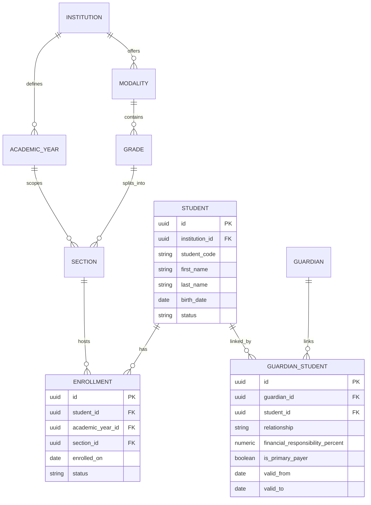

### 4.2 Catálogo financiero y beneficios

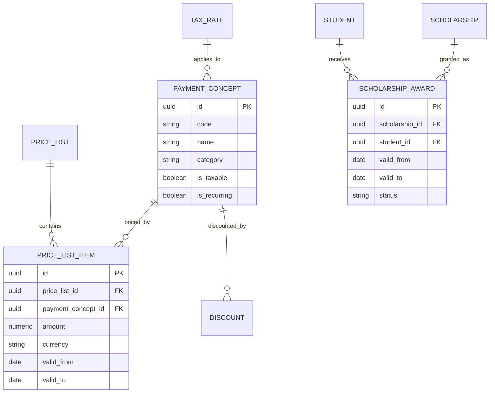

### 4.3 Núcleo financiero: cargos y libro mayor

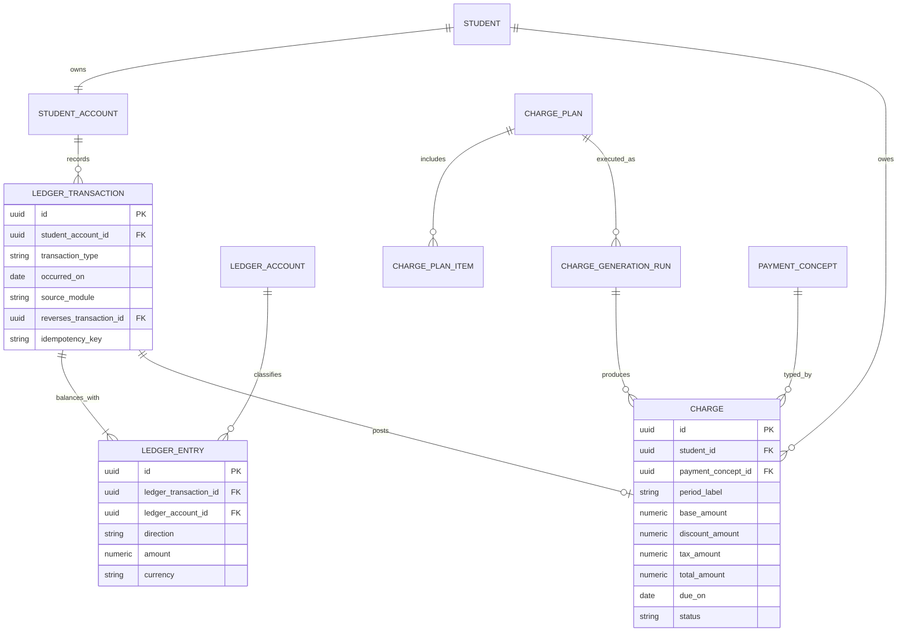

### 4.4 Pagos, caja y facturación

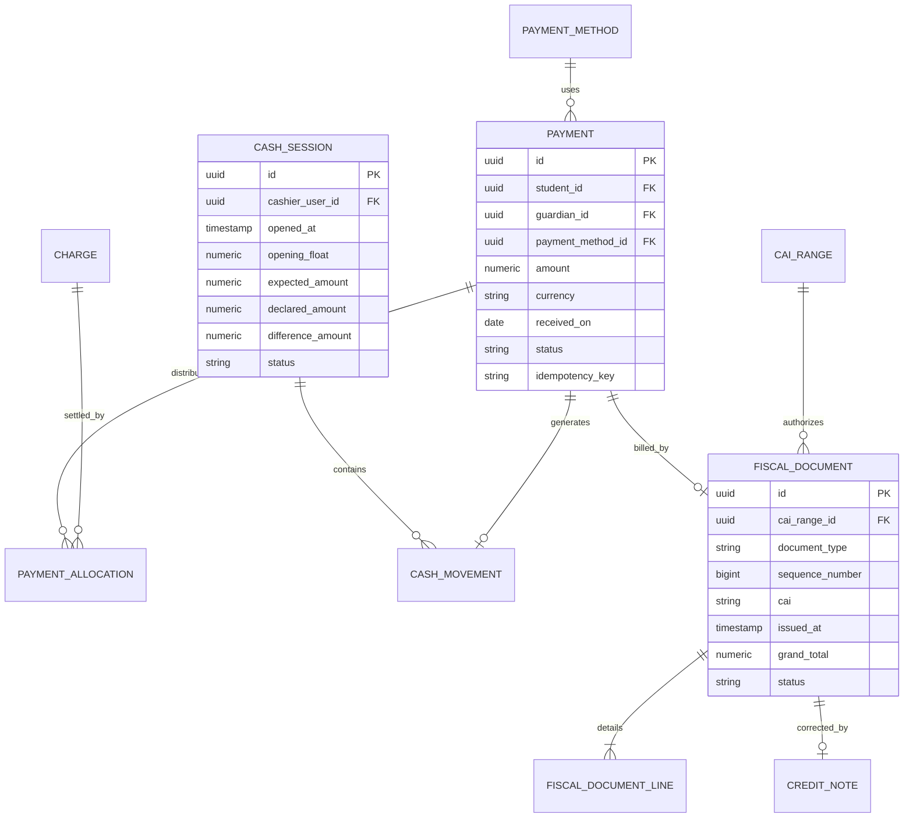

### 4.5 Cobranza y conciliación

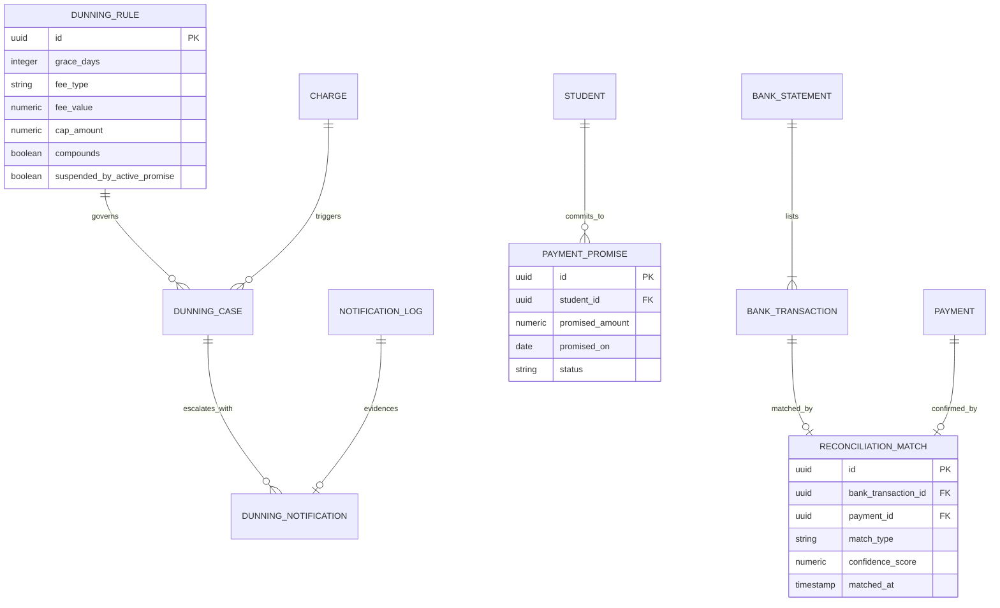

### 4.6 Identidad, portal y auditoría

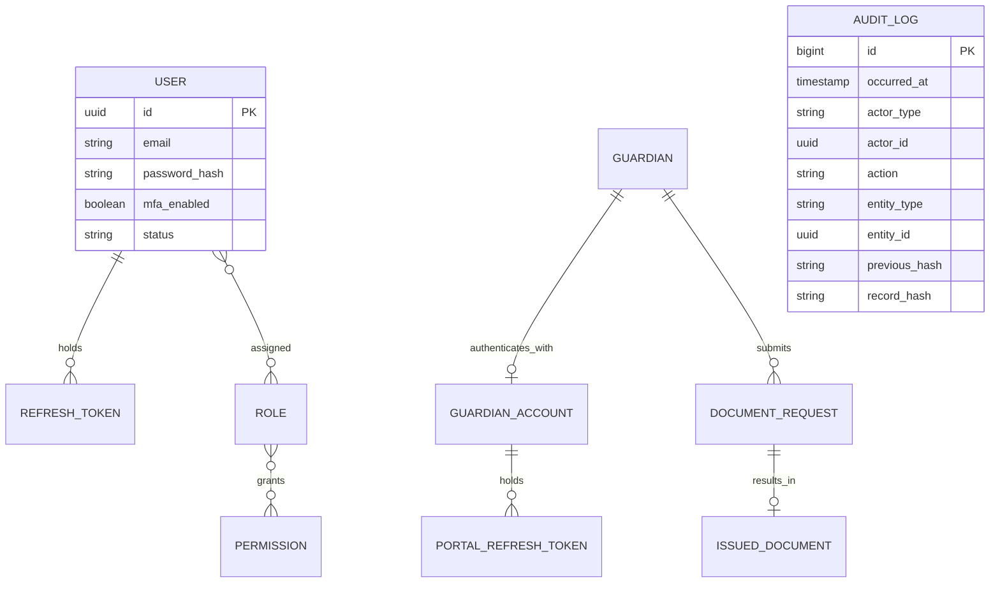

---

## 5. Invariantes de dominio

Invariantes numeradas, verificables y declaradas en el punto más fuerte posible: restricción de
base de datos cuando se puede, prueba de dominio siempre.

### 5.1 Libro mayor

| ID | Invariante | Dónde se aplica |
|---|---|---|
| INV-01 | En cada `LedgerTransaction`, la suma de los `LedgerEntry` de dirección `debit` es exactamente igual a la suma de los de dirección `credit`, en la misma moneda | Disparador de base de datos diferido al final de la transacción, más prueba de dominio y trabajo nocturno de integridad |
| INV-02 | Una `LedgerTransaction` tiene al menos dos `LedgerEntry` | Restricción verificada al cierre de la transacción |
| INV-03 | Un `LedgerEntry` tiene monto estrictamente mayor que cero. El signo lo determina `direction`, nunca el monto | `CHECK (amount > 0)` |
| INV-04 | Una `LedgerTransaction` publicada nunca se actualiza ni se borra. Toda corrección crea una transacción nueva de tipo `reversal` que referencia la original | Sin permiso de `UPDATE` ni `DELETE` para el rol de aplicación sobre `ledger_transaction` y `ledger_entry` |
| INV-05 | Una `LedgerTransaction` de tipo `reversal` referencia exactamente una transacción original, y una transacción original se reversa como máximo una vez | Índice único parcial sobre `reverses_transaction_id` |
| INV-06 | Todos los `LedgerEntry` de una transacción comparten la misma moneda que la `StudentAccount` | `CHECK` más validación de dominio |
| INV-07 | El saldo de una `StudentAccount` es una función pura de sus `LedgerEntry`. El campo `cachedBalance` es una optimización y se reconstruye y compara en el trabajo nocturno; una divergencia genera alerta y bloquea el cierre contable | Trabajo de integridad y alerta operativa |

### 5.2 Cargos, precios y beneficios

| ID | Invariante | Dónde se aplica |
|---|---|---|
| INV-08 | Un `Charge` no puede tener `baseAmount` ni `totalAmount` negativo. Un cobro negativo se modela como nota de crédito o ajuste, nunca como cargo negativo | `CHECK (base_amount >= 0 AND total_amount >= 0)` |
| INV-09 | `totalAmount` de un `Charge` es igual a `baseAmount` menos `discountAmount` más `taxAmount`, con la regla de redondeo declarada una sola vez en `Money`, en el módulo de núcleo del backend | Columna generada o `CHECK`, más prueba de dominio |
| INV-10 | `discountAmount` de un `Charge` nunca excede su `baseAmount` | `CHECK (discount_amount <= base_amount)` |
| INV-11 | Dos `PriceListItem` del mismo `PaymentConcept` dentro de la misma `PriceList` no pueden solapar su vigencia | Restricción `EXCLUDE USING gist` sobre `(payment_concept_id WITH =, daterange(valid_from, valid_to) WITH &&)` |
| INV-12 | Un `PriceListItem` no se edita una vez que existe al menos un `Charge` que lo referencia. El cambio de precio crea una nueva vigencia | Regla de aplicación más ausencia de permiso de `UPDATE` sobre columnas de monto y vigencia |
| INV-13 | Un `Charge` siempre referencia el `PriceListItem` que determinó su precio, o registra explícitamente que su origen es `manual` | `CHECK (price_list_item_id IS NOT NULL OR origin = 'manual')` |
| INV-14 | La generación de cargos es idempotente: no pueden existir dos `Charge` activos para la misma tripleta `studentId`, `paymentConceptId`, `periodLabel` con origen `automatic` | Índice único parcial que excluye estados `reversed` |
| INV-15 | Un `ScholarshipAward` y un `Discount` aplicados al mismo `Charge` no pueden reducir el monto por debajo de cero, y su acumulación solo es válida si todos los beneficios involucrados son acumulables | Validación de dominio con prueba de casos límite |
| INV-16 | El beneficio de beca aplicado a un `Charge` corresponde a un `ScholarshipAward` vigente en la fecha de emisión del cargo | Validación en el motor de devengo |

### 5.3 Pagos y caja

| ID | Invariante | Dónde se aplica |
|---|---|---|
| INV-17 | La suma de las `PaymentAllocation` dirigidas a un `Charge` nunca excede el saldo pendiente de ese cargo | Bloqueo explícito de la fila del cargo más validación transaccional |
| INV-18 | La suma de las `PaymentAllocation` de un `Payment` nunca excede el monto del pago. El remanente se registra como saldo a favor mediante un asiento explícito | Validación transaccional |
| INV-19 | Un `Payment` con monto menor o igual a cero es inválido | `CHECK (amount > 0)` |
| INV-20 | No se puede registrar un pago con un `PaymentMethod` que exige sesión de caja sin una `CashSession` abierta del usuario que registra | `CHECK` condicional más validación de aplicación |
| INV-21 | Una `CashSession` con estado `closed` o `reconciled` no acepta nuevos `CashMovement` | Restricción de aplicación más disparador de base de datos |
| INV-22 | Un usuario no puede tener más de una `CashSession` abierta simultáneamente | Índice único parcial sobre `(cashier_user_id) WHERE status = 'open'` |
| INV-23 | `differenceAmount` de una `CashSession` es igual a `declaredAmount` menos `expectedAmount`. Si es distinto de cero, `differenceReason` es obligatorio y se exige un aprobador distinto del cajero | Columna generada más `CHECK` más regla de segregación de funciones |
| INV-24 | Toda escritura financiera que llega con una `Idempotency-Key` ya vista devuelve la respuesta original sin producir un segundo efecto | Índice único sobre la clave y almacenamiento de la respuesta |

### 5.4 Fiscal

| ID | Invariante | Dónde se aplica |
|---|---|---|
| INV-25 | Un `FiscalDocument` con estado `issued` no se modifica ni se borra jamás. La corrección es anulación o nota de crédito | Sin permiso de `UPDATE` sobre columnas de contenido ni `DELETE` para el rol de aplicación. `contentHash` verificable |
| INV-26 | El par `(issuancePointId, documentType, sequenceNumber)` es único y nunca se reutiliza, ni siquiera tras una anulación | Índice único, más asignación por secuencia con bloqueo, nunca por `MAX(...) + 1` |
| INV-27 | Un `FiscalDocument` solo se emite si su `CaiRange` está activo, dentro de su rango de correlativos y antes de su fecha límite | Validación transaccional con aislamiento serializable |
| INV-28 | Un hueco en la numeración correlativa solo es válido si existe un `FiscalDocument` con estado `voided` que lo explique | Reporte de continuidad y alerta operativa |
| INV-29 | Una `CreditNote` no puede acreditar un monto mayor que el saldo no acreditado de la factura original | Validación transaccional sobre la suma de notas previas |
| INV-30 | La suma de las `FiscalDocumentLine` reproduce exactamente `subtotal`, `taxTotal` y `grandTotal` del documento | `CHECK` más prueba de dominio con casos de redondeo |

### 5.5 Académico e identidad

| ID | Invariante | Dónde se aplica |
|---|---|---|
| INV-31 | Un `Student` no puede tener dos `Enrollment` con estado `active` en el mismo `AcademicYear` | Índice único parcial sobre `(student_id, academic_year_id) WHERE status = 'active'` |
| INV-32 | La suma de `financialResponsibilityPercent` de los `GuardianStudent` vigentes de un mismo estudiante es exactamente 100 | Validación transaccional al crear o modificar vínculos |
| INV-33 | Un `Student` tiene exactamente una `StudentAccount` por moneda | Índice único sobre `(student_id, currency)` |
| INV-34 | Un `Guardian` solo accede en el portal a estudiantes con los que tiene un `GuardianStudent` vigente | Política de seguridad a nivel de fila en PostgreSQL, con prueba de integración obligatoria |
| INV-35 | Un registro de `AuditLog` nunca se actualiza ni se borra, y su `recordHash` incorpora el `previousHash` formando una cadena verificable | Tabla de solo inserción, verificador de cadena periódico |
| INV-36 | Una `PaymentPromise` con estado `active` cubre cargos cuyo saldo pendiente es mayor que cero al momento de crearla | Validación de aplicación |

---

## 6. Máquinas de estado

### 6.1 Charge

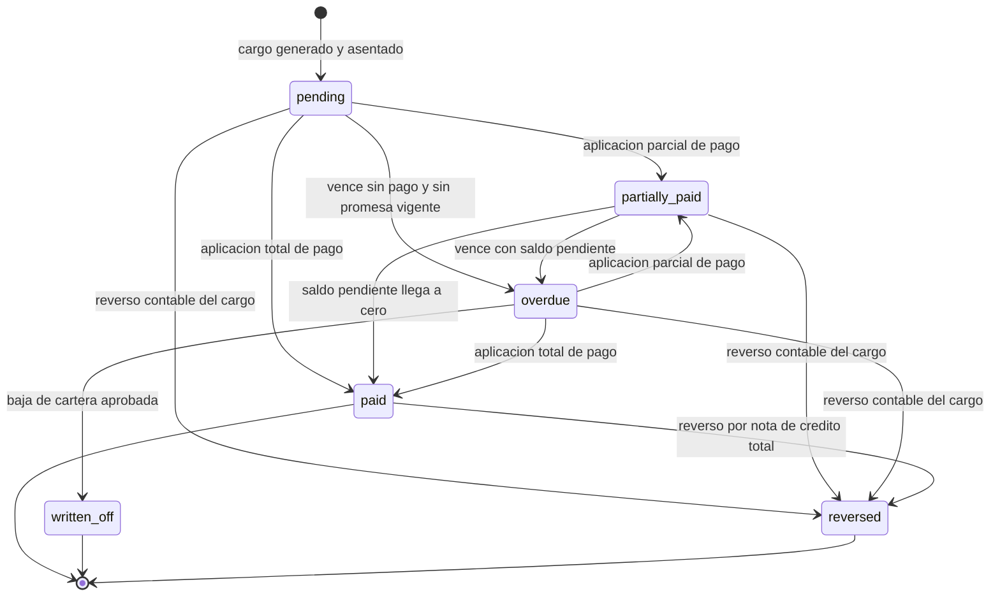

Notas: `written_off` no borra la deuda histórica, la reclasifica contablemente. `reversed` exige
un asiento de reverso en `Ledger` y motivo registrado en `AuditLog`.

### 6.2 Payment

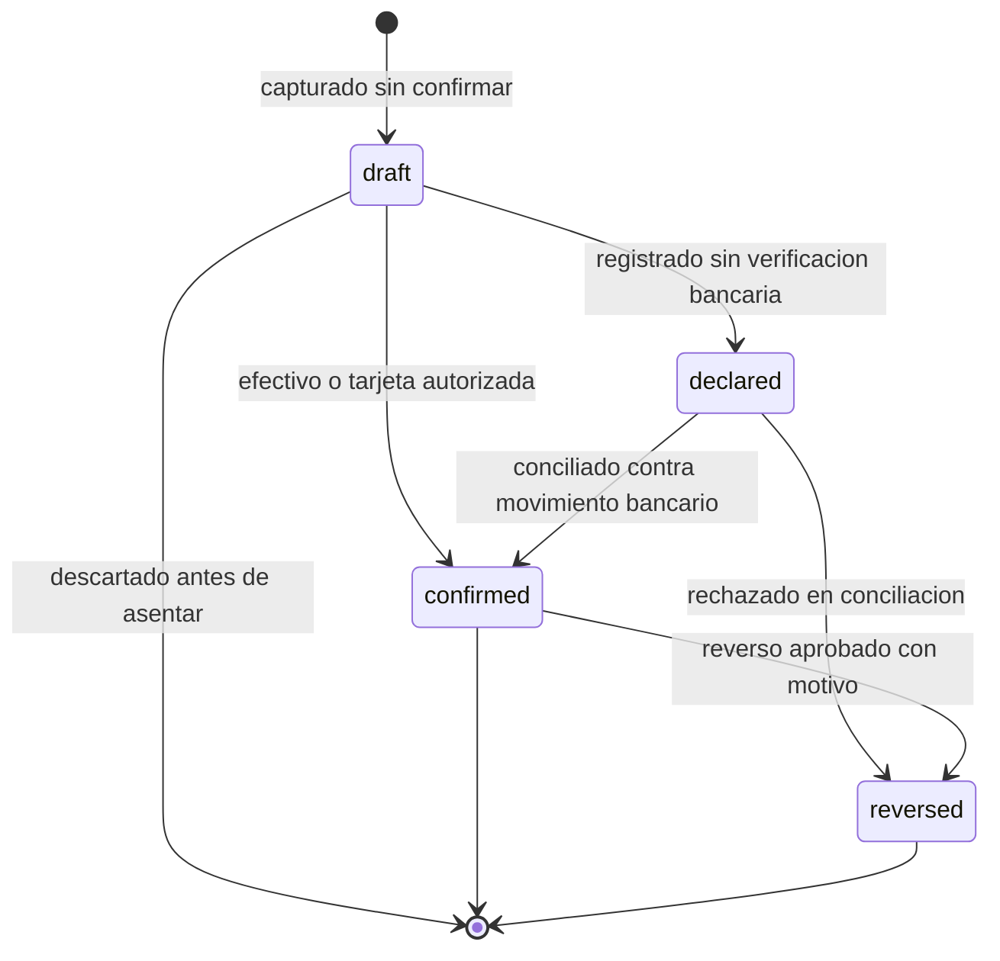

Notas: solo `confirmed` produce asiento definitivo en el libro mayor. `declared` puede aplicar de
forma provisional con alerta configurable, según la política definida en `docs/04-cumplimiento-fiscal-sar.md`.

### 6.3 FiscalDocument

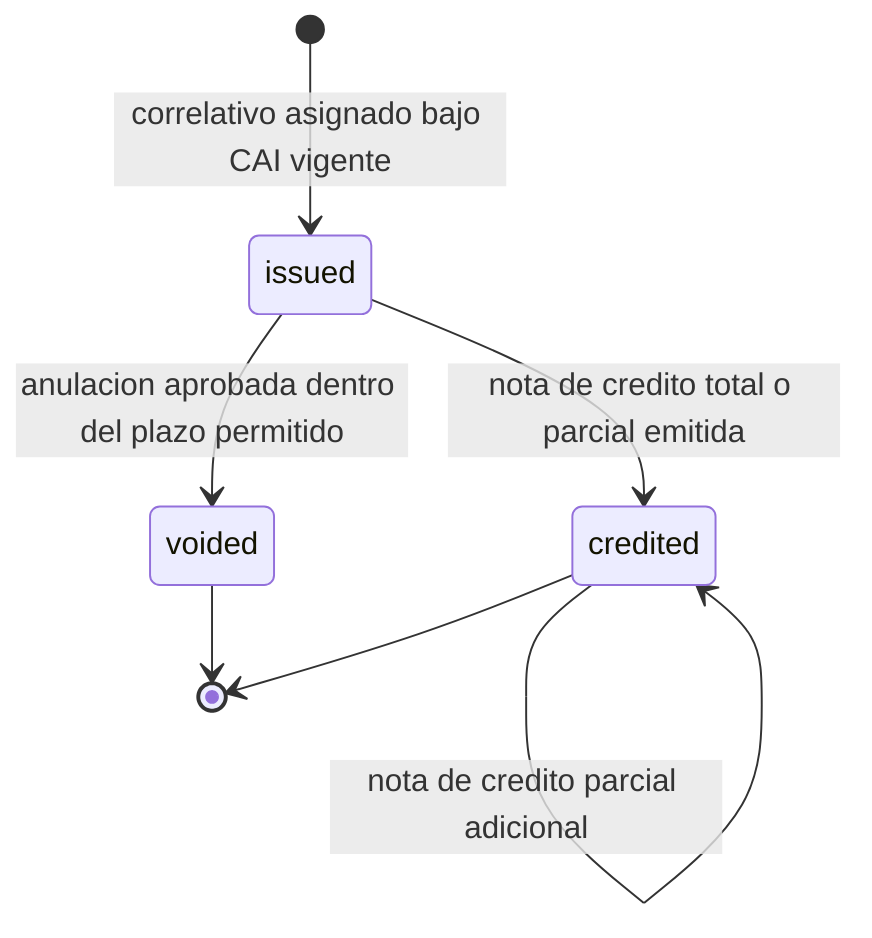

Notas: no existe transición de salida desde `issued` que modifique el documento. `voided` y
`credited` son estados derivados de documentos nuevos, no ediciones. El plazo de anulación debe
validarse con el contador de la institución y con la normativa vigente del SAR.

### 6.4 PaymentPromise

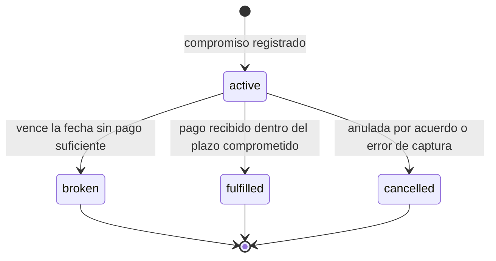

Notas: mientras el estado sea `active`, la regla de mora puede suspender el recargo si
`DunningRule.suspendedByActivePromise` es verdadero. Al pasar a `broken`, el recargo se recalcula
desde la fecha original de vencimiento del cargo.

### 6.5 DocumentRequest

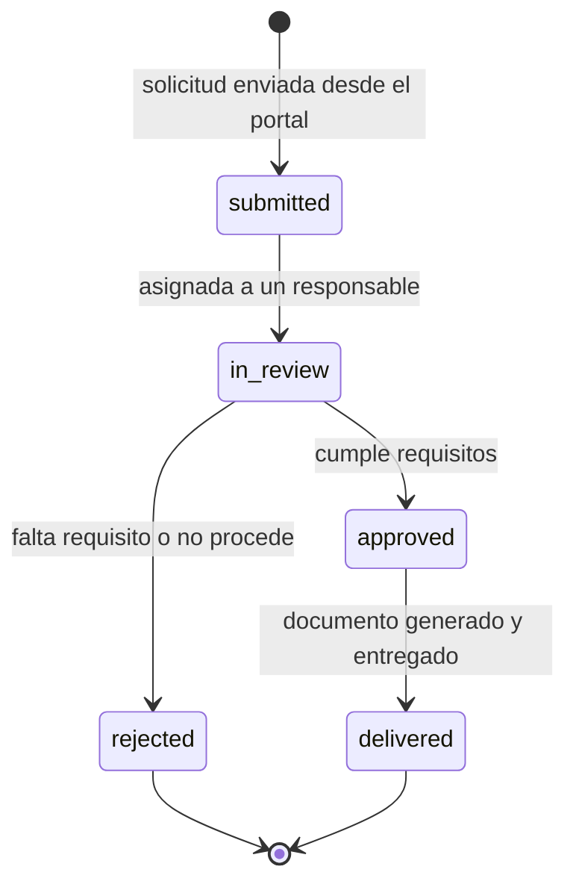

Notas: la transición a `approved` puede exigir que el estudiante no tenga saldo vencido, según
política configurable de la institución.

### 6.6 CashSession

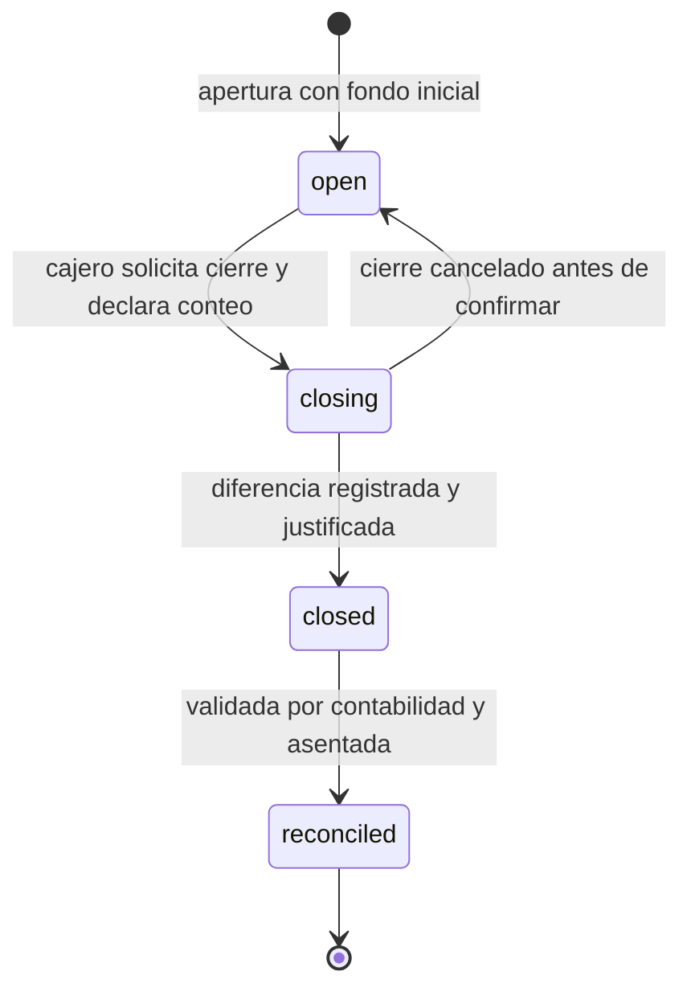

Notas: en estado `closing` la sesión ya no acepta nuevos cobros. La transición a `closed` con
diferencia distinta de cero exige motivo y aprobador distinto del cajero (INV-23).

---

## 7. Eventos de dominio

Los eventos se publican dentro de la misma transacción que produce el cambio y quedan persistidos
en el registro de publicación de eventos de Spring Modulith, que los reenvía si el oyente falla
(ADR-0015). Comunican módulos dentro del mismo proceso y sirven para reacciones internas y
rápidas. Cuando un consumidor necesita trabajo lento, externo o diferido (enviar un correo,
generar un PDF, llamar a un proveedor), su oyente **programa una tarea** de db-scheduler en
`confia-worker` y nunca ejecuta ese trabajo por sí mismo (ADR-0016). No hay intermediario de
mensajes. Ningún consumidor puede asumir entrega exactamente una vez: todo manejador, de evento o
de tarea, es idempotente.

Reglas de diseño de eventos que se persisten en el registro (ADR-0017):

- **Sin datos personales.** Un evento lleva identificadores y hechos: nunca nombres, correos,
  teléfonos ni documentos de identidad. El registro es una tabla técnica sin seguridad a nivel de
  fila, y el consumidor carga lo que necesita desde la base dentro de su transacción.
- **El consumidor revalida.** Todo manejador comprueba contra la base de datos cada entidad que el
  evento referencia y recalcula cada importe; no confía en el contenido del evento.
- **El proceso del portal no publica eventos persistidos.** Sus reacciones durables se programan
  como tareas de db-scheduler.

| Evento | Emisor | Consumidores | Efecto |
|---|---|---|---|
| `StudentEnrolled` | `Students` | `Charges`, `Ledger`, `Notifications` | Crea `StudentAccount` si no existe, activa el plan de cobro aplicable, envía bienvenida |
| `EnrollmentWithdrawn` | `Students` | `Charges`, `Collections` | Detiene el devengo futuro, evalúa saldo a favor y cierra casos de cobranza |
| `GuardianLinked` | `Guardians` | `Portal`, `Notifications` | Habilita el acceso al estado de cuenta y dispara la verificación de correo |
| `PriceListItemActivated` | `Catalog` | `Charges` | Invalida la caché de precios vigentes del período |
| `ScholarshipAwarded` | `Scholarships` | `Charges`, `Notifications` | Aplica el beneficio a cargos futuros y notifica al encargado |
| `ChargeGenerated` | `Charges` | `Ledger`, `Collections`, `Notifications` | Asienta el devengo, programa el vencimiento y avisa del nuevo cargo |
| `ChargeOverdue` | `Charges` | `Collections` | Abre un `DunningCase` y evalúa la regla de mora |
| `LateFeeApplied` | `Collections` | `Ledger`, `Notifications` | Asienta el recargo y notifica con evidencia previa de aviso |
| `PaymentRegistered` | `Payments` | `Cashbox`, `Invoicing`, `Collections` | Registra el movimiento de caja, habilita la facturación y evalúa promesas |
| `PaymentConfirmed` | `Payments` | `Ledger`, `Collections`, `Reporting` | Asienta definitivamente, cierra cargos y actualiza indicadores |
| `PaymentReversed` | `Payments` | `Ledger`, `Invoicing`, `Collections` | Asienta el reverso, marca el documento fiscal y reabre los cargos afectados |
| `CreditBalanceCreated` | `Payments` | `Ledger`, `Notifications` | Registra el excedente como saldo a favor disponible |
| `CashSessionClosed` | `Cashbox` | `Ledger`, `Reporting`, `Notifications` | Asienta la diferencia si existe y publica el reporte de cierre |
| `FiscalDocumentIssued` | `Invoicing` | `Reporting`, `Notifications`, `Documents` | Alimenta el libro de ventas, envía el PDF y archiva el documento |
| `FiscalDocumentVoided` | `Invoicing` | `Ledger`, `Reporting` | Asienta el reverso y registra el hueco de correlativo justificado |
| `CreditNoteIssued` | `Invoicing` | `Ledger`, `Reporting`, `Notifications` | Asienta la acreditación y ajusta el saldo del estudiante |
| `CaiRangeThresholdReached` | `Invoicing` | `Notifications`, `Reporting` | Alerta operativa por consumo o proximidad de vencimiento del rango |
| `PaymentPromiseCreated` | `Collections` | `Charges`, `Notifications` | Suspende el recargo si la regla lo permite y confirma al encargado |
| `PaymentPromiseBroken` | `Collections` | `Charges`, `Notifications` | Reactiva el cálculo de mora y escala la cobranza |
| `DunningNotificationSent` | `Collections` | `Reporting` | Registra la evidencia que habilita aplicar el recargo |
| `BankStatementImported` | `Reconciliation` | `Payments` | Dispara el motor de emparejamiento automático |
| `PaymentReconciled` | `Reconciliation` | `Payments`, `Ledger` | Transiciona el pago de `declared` a `confirmed` |
| `DocumentRequestApproved` | `Documents` | `Notifications` | Genera el PDF con folio verificable y notifica la entrega |
| `SensitiveActionPerformed` | Cualquier módulo | `shared/audit` | Escribe el registro encadenado en `AuditLog` |

---

## 8. Reglas de modelado transversales

1. **Dinero.** Todo importe es un objeto de valor inmutable `Money` del módulo de núcleo del backend, que encapsula un `BigDecimal` normalizado a escala cuatro y una moneda ISO 4217 explícita, con redondeo explícito `HALF_UP`. En PostgreSQL, `NUMERIC(14,4)` acompañado de la columna de moneda. En la API, `{ amount: string, currency: string }`. Nunca coma flotante. Ver ADR-0004.
2. **Identificadores.** UUID versión 7 como clave primaria, para orden temporal e índices eficientes. Los correlativos fiscales son la única numeración de negocio consecutiva.
3. **Multi-institución.** Toda tabla de negocio lleva `institution_id` desde la primera migración, con índice compuesto en cada consulta de listado.
4. **Borrado.** No existe borrado físico en tablas financieras. Las tablas de catálogo usan desactivación lógica, nunca `DELETE`.
5. **Tiempo.** `timestamptz` siempre. La zona horaria de presentación viene de `Institution.timezone`. Las fechas de negocio como `dueOn` u `occurredOn` son `date` sin zona.
6. **Datos sensibles.** Documentos de identidad y datos de contacto de menores se almacenan cifrados o con hash según su uso, conforme a `docs/08-datos-privacidad-y-retencion.md`.
7. **Enumeraciones.** Se modelan como tipo de PostgreSQL o tabla de catálogo con código estable en inglés. La etiqueta visible viene del catálogo de internacionalización.

---

## 9. Documentos relacionados

| Documento | Contenido |
|---|---|
| `docs/01-arquitectura.md` | Fuente de verdad técnica y decisión de libro mayor |
| `docs/00-vision-y-alcance.md` | Alcance funcional y actores |
| `docs/04-cumplimiento-fiscal-sar.md` | Reglas fiscales concretas, sujetas a validación con el contador |
| `docs/09-roadmap-y-fases.md` | Fase en la que se construye cada contexto |
| `docs/14-glosario.md` | Glosario ampliado |
