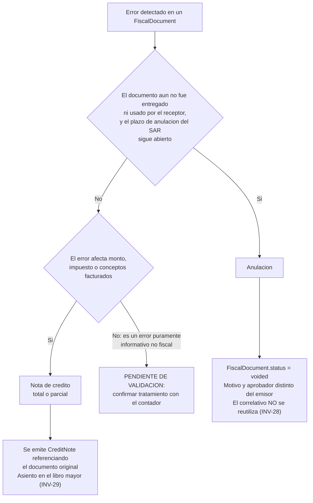

# CONFIA — Cumplimiento fiscal SAR (Honduras)

> Estado: **Propuesta v1.0** — pendiente de aprobación del propietario del producto.
> Subordinado a `docs/01-arquitectura.md`. Los nombres de entidad usados aquí corresponden
> uno a uno con `docs/02-modelo-de-dominio.md`, sección 2.11 (`Invoicing`).

---

> ## ADVERTENCIA OBLIGATORIA
>
> Este documento describe los **requisitos funcionales** que el sistema debe soportar para
> operar bajo el régimen de facturación del Servicio de Administración de Rentas (SAR) de
> Honduras. **No constituye asesoría fiscal ni contable.**
>
> Toda regla, tasa, formato de documento, plazo de anulación y período de retención descrito
> aquí debe validarse por escrito con el **contador de la institución** y contra la
> **normativa vigente del SAR** antes de implementarse en código y antes de emitir el primer
> documento fiscal real. El sistema no debe salir a producción fiscal (fin de la fase F5 del
> roadmap) sin esa validación firmada.
>
> Cada punto que depende de una cifra, un formato o un plazo que este documento no puede
> afirmar con certeza está marcado explícitamente con la etiqueta **PENDIENTE DE VALIDACIÓN**.
> Un desarrollador que encuentre esa etiqueta no debe codificar el valor propuesto como
> definitivo: debe detenerse y confirmarlo primero.

---

## 1. Conceptos

| Concepto | Término en código | Definición operativa |
|---|---|---|
| Registro Tributario Nacional (RTN) | `taxpayerId` | Identificador fiscal del contribuyente hondureño. Aplica tanto a la institución emisora como, cuando corresponde, al receptor del documento. Formato numérico de longitud fija — **PENDIENTE DE VALIDACIÓN** el número exacto de dígitos y su máscara de captura vigente |
| Código de Autorización de Impresión (CAI) | `cai` | Código alfanumérico que el SAR emite para autorizar a un contribuyente a emitir documentos fiscales dentro de un rango de correlativos y un plazo determinado. Es la autorización, no el documento |
| Punto de emisión | `emissionPointCode` | Identificador de la caja, módulo o terminal específico desde el que se emite el documento, dentro de un establecimiento |
| Establecimiento | `establishmentCode` | Identificador de la sede física o punto de negocio registrado ante el SAR. Una institución con una sola sede tiene un único establecimiento; una red de colegios tendría uno por plantel |
| Correlativo | `sequenceNumber` | Número consecutivo, irrepetible y sin huecos no justificados, asignado a cada documento dentro de un rango CAI |
| Rango autorizado | `rangeFrom` / `rangeTo` | Intervalo cerrado de correlativos que el CAI autoriza a emitir para una combinación de establecimiento, punto de emisión y tipo de documento |
| Fecha límite de emisión | `issuanceDeadline` | Fecha después de la cual el CAI deja de ser válido, aunque el rango no se haya agotado. Emitir después de esa fecha es tan inválido como emitir fuera de rango |

Estos siete conceptos son la base de toda la sección 3 (modelo de datos) y de las invariantes
INV-25 a INV-30 de `docs/02-modelo-de-dominio.md`.

---

## 2. Estructura del número de documento fiscal

La convención histórica del régimen de facturación por CAI en Honduras compone el número de
documento a partir de cuatro segmentos:

```
EEE-PPP-TT-CCCCCCCC
│    │   │   └── Correlativo (8 dígitos, con ceros a la izquierda)
│    │   └────── Tipo de documento (2 dígitos: código SAR del tipo)
│    └────────── Punto de emisión (3 dígitos)
└─────────────── Establecimiento (3 dígitos)
```

Ejemplo ilustrativo: `001-001-01-00000001`. **PENDIENTE DE VALIDACIÓN**: la longitud exacta
de cada segmento, el separador (guion frente a otro carácter) y los códigos numéricos que el
SAR asigna a cada tipo de documento deben confirmarse contra la resolución vigente y contra el
CAI real que la institución obtenga, porque el régimen fiscal hondureño ha evolucionado hacia
la facturación electrónica (SAR/DEI) y el formato puede diferir según el esquema bajo el cual
se autorice a la institución.

### Modelado en base de datos

El número de documento **no se almacena como una sola cadena concatenada**. Se descompone en
columnas independientes y se deriva la cadena de presentación en el punto de emisión y en el
PDF, nunca al revés:

| Columna en `FiscalDocument` | Tipo | Origen |
|---|---|---|
| `establishment_code` | `varchar` | Copiado del `CaiRange` vigente al momento de emitir |
| `emission_point_code` | `varchar` | Copiado del `CaiRange` vigente al momento de emitir |
| `document_type` | `enum` | Determinado por el flujo de negocio que origina la emisión |
| `sequence_number` | `bigint` | Asignado por la secuencia dedicada del rango, bajo bloqueo |

Guardar los segmentos por separado, en vez de una cadena única, permite indexar, validar
continuidad y detectar huecos por segmento sin parsear texto, y evita que un error de formato
en la presentación corrompa el dato de negocio.

---

## 3. Modelo de datos de rangos CAI

Tabla `cai_range`. Un registro por autorización del SAR para una combinación de
establecimiento, punto de emisión y tipo de documento.

| Campo | Tipo | Restricciones |
|---|---|---|
| `id` | `uuid` | Clave primaria, UUID versión 7 |
| `institution_id` | `uuid` | `NOT NULL`, clave foránea a `institution`. Aislamiento multi-institución desde el primer registro |
| `cai` | `varchar(50)` | `NOT NULL`. Longitud provisional — **PENDIENTE DE VALIDACIÓN** contra el formato real del código emitido por el SAR |
| `document_type` | `enum fiscal_document_type` | `NOT NULL`. Valores: `invoice`, `credit_note`, `debit_note`, `receipt` |
| `establishment_code` | `varchar(10)` | `NOT NULL` |
| `emission_point_code` | `varchar(10)` | `NOT NULL` |
| `range_from` | `bigint` | `NOT NULL`, `CHECK (range_from > 0)` |
| `range_to` | `bigint` | `NOT NULL`, `CHECK (range_to >= range_from)` |
| `current_number` | `bigint` | `NOT NULL`, `DEFAULT range_from - 1`. Último correlativo efectivamente asignado. `CHECK (current_number >= range_from - 1 AND current_number <= range_to)` |
| `authorized_on` | `date` | `NOT NULL`. Fecha en que el SAR autorizó el rango |
| `issuance_deadline` | `date` | `NOT NULL`, `CHECK (issuance_deadline > authorized_on)` |
| `status` | `enum cai_range_status` | `NOT NULL`, `DEFAULT 'pending'`. Valores: `pending`, `active`, `exhausted`, `expired`, `suspended` |
| `created_at` / `updated_at` | `timestamptz` | `NOT NULL` |

**Restricciones adicionales:**

- `UNIQUE (institution_id, establishment_code, emission_point_code, document_type) WHERE status = 'active'`
  — a lo sumo un rango activo por combinación de establecimiento, punto de emisión y tipo de
  documento. Evita ambigüedad al elegir qué rango usar en una emisión.
- `CHECK (current_number <= range_to)` reforzado también en la capa de aplicación antes de
  cada asignación, porque una restricción de base de datos por sí sola no impide una condición
  de carrera sin el bloqueo descrito en la sección 4.
- Índice sobre `(institution_id, status)` para las consultas del panel de control de rangos
  CAI (brecha A5 de `docs/10-analisis-de-brechas.md`).

El correlativo asignado a cada documento vive en `FiscalDocument.sequence_number`
(`docs/02-modelo-de-dominio.md`, sección 4.4), no en `cai_range`. `cai_range.current_number`
es el marcador de avance de la secuencia, no el historial: el historial completo son las filas
de `FiscalDocument`.

---

## 4. Reglas operativas de correlativo

1. **Asignación bajo bloqueo, con secuencia dedicada.** Cada `CaiRange` activo tiene asociada
   una secuencia de asignación propia. Al emitir, la transacción toma un bloqueo explícito
   sobre la fila del `CaiRange` (`SELECT ... FOR UPDATE`) antes de leer `current_number`,
   incrementarlo y escribir el `FiscalDocument`. Aislamiento `SERIALIZABLE` en esa transacción,
   igual que el cierre de caja (`docs/01-arquitectura.md`, sección 6).
2. **Prohibida la reutilización.** Un `sequence_number` ya asignado, sea al documento que
   termine `issued`, `voided` o corregido por nota de crédito, no vuelve a asignarse jamás.
   Índice único sobre `(cai_range_id, sequence_number)`.
3. **Prohibido calcular el correlativo con `MAX(sequence_number) + 1`.** Ese patrón es una
   condición de carrera bajo concurrencia y además no distingue un hueco legítimo de una fila
   que aún no se confirmó. El único origen válido del siguiente número es el `current_number`
   del `CaiRange` bajo bloqueo.
4. **Tratamiento de huecos.** Un hueco en la numeración solo es válido si corresponde a un
   `FiscalDocument` con estado `voided` que lo explica (INV-28). El correlativo de un
   documento anulado **no se reutiliza**: se marca como consumido y anulado, y el sistema
   avanza. Un hueco sin documento `voided` que lo justifique es un defecto de integridad y
   dispara alerta operativa inmediata, no solo un reporte al final del período.
5. **Bloqueo de emisión cuando el rango se agota o vence.** Ninguna emisión procede si
   `current_number` alcanzaría un valor mayor que `range_to`, o si la fecha de la transacción
   es posterior a `issuance_deadline`, o si `status` no es `active` (INV-27). El sistema
   rechaza la operación con un mensaje explícito dirigido al usuario administrativo, nunca con
   un error genérico, porque la acción correctiva (tramitar un nuevo rango) depende de que la
   persona entienda exactamente qué ocurrió.

---

## 5. Alertas obligatorias

Los umbrales son valores sugeridos y **configurables por institución**, nunca codificados
como constante fija en el programa.

### Por porcentaje de rango consumido

| Umbral sugerido | Qué hace el sistema |
|---|---|
| 70 % | Notificación informativa a administración y contabilidad. Aparece en el panel de control de rangos CAI, sin interrumpir la operación |
| 85 % | Alerta de advertencia, repetida diariamente mientras el rango siga en ese estado, visible en el panel y enviada por el canal configurado de notificaciones operativas |
| 95 % | Alerta crítica con acuse de recibo obligatorio por parte de un usuario con el permiso correspondiente. Se escalona a la dirección además de a contabilidad. El sistema **todavía no bloquea la emisión**, porque bloquear antes de que el rango se agote de verdad interrumpiría la operación sin necesidad |

### Por días restantes hasta la fecha límite de emisión

| Umbral sugerido | Qué hace el sistema |
|---|---|
| 60 días | Notificación informativa a administración y contabilidad |
| 30 días | Alerta de advertencia diaria |
| 15 días | Alerta crítica con acuse de recibo obligatorio y escalamiento a dirección |

### Al agotamiento o vencimiento efectivo

Cuando el rango se agota (`current_number` alcanza `range_to`) o se cumple
`issuance_deadline`, el sistema transiciona el `CaiRange` a `exhausted` o `expired` según
corresponda y **bloquea toda emisión nueva bajo ese rango** (sección 4, punto 5). El bloqueo es
por diseño: emitir fuera de rango o fuera de plazo no es un error recuperable después del
hecho, es un documento fiscal inválido desde el momento de su creación.

Estos umbrales alimentan el evento `CaiRangeThresholdReached` descrito en
`docs/02-modelo-de-dominio.md`, sección 7.

---

## 6. Tipos de documento

| Tipo | Término en código | Cuándo aplica |
|---|---|---|
| Factura | `invoice` | Documento fiscal principal, emitido a partir de un `Payment` confirmado o de un cargo facturable. Es el único tipo que otro documento puede corregir |
| Nota de crédito | `credit_note` | Corrige, total o parcialmente, el monto o los conceptos de una factura ya emitida, cuando la factura no puede anularse (sección 8) |
| Nota de débito | `debit_note` | Incrementa el monto adeudado sobre una factura ya emitida por un concepto adicional no incluido originalmente, cuando la corrección debe aumentar y no disminuir el saldo. Uso menos frecuente en el contexto de colegiaturas; su aplicabilidad exacta al modelo de cobro académico — **PENDIENTE DE VALIDACIÓN** con el contador |
| Recibo | `receipt` | Comprobante de un cobro que **no** constituye por sí mismo el documento fiscal de venta, usado en los casos que la normativa distinga entre comprobante de caja y factura. Su alcance exacto frente a la factura — **PENDIENTE DE VALIDACIÓN** |

---

## 7. Impuesto sobre ventas (ISV)

### Tasas como configuración, nunca codificadas

Las tasas del impuesto sobre ventas se modelan en la entidad `TaxRate`
(`docs/02-modelo-de-dominio.md`, sección 2.5, contexto `Catalog`), con **vigencia desde y
hasta**, igual que un precio de `PriceListItem`. Ninguna tasa se escribe como literal numérico
en el código del backend (ni en el módulo de núcleo ni en un paquete `domain`), en un
controlador ni en un componente de frontend. Cambiar una tasa es
crear una nueva vigencia de `TaxRate`, nunca editar la existente, por la misma razón que un
precio no se edita: alteraría retroactivamente el impuesto de documentos ya emitidos.

> Cualquier cifra de tasa que aparezca en un ejemplo de este documento o de la especificación
> técnica es **ilustrativa**, no normativa. La tasa general del impuesto sobre ventas vigente
> en Honduras debe confirmarse contra la resolución del SAR en vigor al momento de configurar
> el sistema — **PENDIENTE DE VALIDACIÓN**.

### Operaciones exentas y exoneradas

Son tratamientos distintos y no intercambiables:

| Tratamiento | Definición operativa | Qué debe registrar el sistema |
|---|---|---|
| Exento | La ley excluye la operación del impuesto de forma general, sin que el contribuyente necesite una autorización individual | `TaxRate` con tasa cero y motivo de exención declarado en el documento, cuando la normativa lo exige |
| Exonerado | Un sujeto o una operación específica cuenta con una autorización o constancia de exoneración emitida por la autoridad competente | Referencia al número de constancia o resolución de exoneración, con su propia vigencia, asociada al `Payment` o al receptor del documento |

### Nota destacada: servicios educativos

> Los servicios educativos suelen recibir un tratamiento fiscal especial (exención total,
> parcial o condicionada) en muchas jurisdicciones, incluida potencialmente Honduras. **Este
> documento no afirma cuál es ese tratamiento.** Es exactamente el tipo de regla que debe
> confirmarse por escrito con el contador de la institución y contra la normativa vigente
> antes de configurar cualquier `TaxRate` para los conceptos de colegiatura, matrícula y
> demás servicios académicos. Configurar una tasa gravada por defecto sobre un servicio que
> la ley exime, o viceversa, no es un error de presentación: es una declaración fiscal
> incorrecta. **PENDIENTE DE VALIDACIÓN.**

---

## 8. Árbol de decisión: anulación frente a nota de crédito



**Regla de fondo.** La anulación asume que el documento nunca circuló de forma efectiva: es la
corrección de algo que todavía no produjo efecto legal hacia el receptor. La nota de crédito
asume lo contrario: el documento original es válido y produjo efecto, y lo que se corrige es el
saldo. Confundir los dos caminos, por ejemplo anulando una factura que el encargado ya recibió
y pagó, es el tipo de error que una auditoría detecta de inmediato. El **plazo** dentro del cual
la anulación sigue siendo el camino legal correcto, en vez de la nota de crédito, es una regla
temporal concreta del SAR — **PENDIENTE DE VALIDACIÓN**.

En ambos casos aplica INV-25: el `FiscalDocument` original nunca se modifica ni se borra. Tanto
`voided` como el estado `credited` resultante de una nota de crédito son estados derivados de
un evento nuevo, no ediciones del documento original (`docs/02-modelo-de-dominio.md`,
sección 6.3).

---

## 9. Requisitos de contenido de un documento fiscal

Contenido mínimo que un documento emitido debe incluir, con lo que depende de normativa
marcado como tal:

| Elemento | Origen del dato | Nota |
|---|---|---|
| Datos del emisor: nombre, RTN, dirección del establecimiento | `Institution`, `cai_range` | — |
| CAI, rango autorizado, fecha límite de emisión | `CaiRange` | Debe imprimirse tal como el SAR lo exige — **PENDIENTE DE VALIDACIÓN** el texto exacto de la leyenda |
| Número de documento completo (establecimiento, punto de emisión, tipo, correlativo) | `FiscalDocument` | Ver sección 2 |
| Fecha y hora de emisión | `FiscalDocument.issued_at` | — |
| Datos del receptor: nombre, RTN o identificación cuando aplique | `Guardian` / `Student` | El umbral de monto a partir del cual el RTN del receptor es obligatorio — **PENDIENTE DE VALIDACIÓN** |
| Detalle de líneas: concepto, cantidad, precio unitario, descuento, impuesto | `FiscalDocumentLine` | INV-30 exige que la suma reproduzca exactamente `subtotal`, `taxTotal` y `grandTotal` |
| Subtotal, impuestos desglosados por tasa, total | `FiscalDocument` | — |
| Forma de pago | `Payment.method` | — |
| Leyendas legales obligatorias | — | **PENDIENTE DE VALIDACIÓN** contra la normativa vigente. No se inventan aquí |

### Diseño de la representación imprimible en PDF

- Generado a partir de una plantilla versionada, nunca de texto embebido en el código de la
  aplicación. Un cambio de plantilla no altera el contenido estructurado ya emitido.
- El PDF se genera **una sola vez**, en el momento de la emisión, a partir de los datos ya
  persistidos e inmutables del `FiscalDocument`. No se regenera bajo demanda con datos
  recalculados: eso permitiría que un cambio posterior en, por ejemplo, el nombre del
  estudiante, alterara silenciosamente un documento fiscal ya emitido.
- Incluye un código de verificación o un enlace corto que permite confirmar la autenticidad del
  documento sin exponer datos personales adicionales del estudiante o del encargado, siguiendo
  el mismo principio que el folio verificable de `docs/10-analisis-de-brechas.md`, brecha A4.
- Tipografía y montos con formato de `Intl.NumberFormat`, alineados a la derecha, con moneda y
  dos decimales, igual que en pantalla (`CLAUDE.md`, sección Frontend).
- El PDF se archiva junto con el documento estructurado en almacenamiento compatible con S3
  (sección 10).

---

## 10. Retención documental

| Aspecto | Requisito |
|---|---|
| Período de conservación | El período legal mínimo exigido por el SAR para documentos fiscales — **PENDIENTE DE VALIDACIÓN**. El sistema debe modelar el período como configuración, no como constante, para poder ajustarlo sin desplegar código nuevo |
| Almacenamiento del PDF | Objeto inmutable en almacenamiento compatible con S3 (`docs/01-arquitectura.md`, sección 3.1). Si el proveedor lo soporta, con política de retención a nivel de objeto (*object lock* / WORM) que impide el borrado incluso por un administrador de la cuenta de almacenamiento durante el período de retención |
| Almacenamiento de los datos estructurados | Las filas de `FiscalDocument` y `FiscalDocumentLine` nunca se borran físicamente (INV-25, `CLAUDE.md` regla 5). La retención estructurada vive en la misma base de datos que el resto del libro mayor, sujeta a los mismos respaldos |
| Verificación de integridad | Cada `FiscalDocument` almacena un `contentHash` calculado sobre sus datos estructurados en el momento de la emisión. Un trabajo periódico recalcula el hash de una muestra de documentos y de sus PDF archivados y compara contra el valor almacenado; una divergencia genera alerta crítica, con el mismo principio que la cadena de hash de `AuditLog` (INV-35) |

---

## 11. Reportes fiscales

- **Libro de ventas del período.** Listado cronológico de todos los `FiscalDocument` emitidos,
  anulados y corregidos por nota de crédito en un rango de fechas, con columnas de subtotal,
  impuesto desglosado por tasa y total. Incluye el reporte de continuidad de correlativos
  (sección 4, punto 4), donde todo hueco muestra el `FiscalDocument` `voided` que lo justifica.
- **Exportaciones para contabilidad.** Formato de exportación del libro de ventas compatible
  con lo que el sistema contable de la institución pueda importar (CSV o el formato específico
  que se determine), coherente con la brecha A3 de `docs/10-analisis-de-brechas.md` y con la
  fase F7 del roadmap. El mapeo exacto de columnas contra el plan de cuentas de la institución
  es trabajo de esa fase, no de este documento.

---

## 12. Preparación para facturación electrónica futura

`docs/01-arquitectura.md`, sección 10, declara explícitamente que la facturación electrónica
queda fuera del alcance actual, pero que el puerto de emisión se diseña desde el inicio para no
exigir una reescritura cuando ese régimen se active. El mecanismo es el patrón puerto y
adaptador ya usado en todo el sistema (`CLAUDE.md`, sección Estructura y reglas de dependencia):
la capa `application` de `invoicing` depende de una interfaz abstracta, y `infrastructure`
provee el adaptador concreto.

El ejemplo siguiente es ilustrativo: la forma definitiva se especifica en la fase F5. Se muestra
en un solo bloque por legibilidad; en el código real cada tipo público vive en su propio archivo.
`<paquete-base>` es un marcador del paquete base de Java, que se fija en F0
(`docs/01-arquitectura.md`, sección 4).

```java
// <paquete-base>/invoicing/application/port/FiscalDocumentIssuer.java (and sibling types)
// Money is the value object of the backend kernel module (no dependencies outside the JDK).

import java.math.BigDecimal;
import java.time.Instant;
import java.util.List;
import java.util.UUID;

public enum FiscalDocumentType { INVOICE, CREDIT_NOTE, DEBIT_NOTE, RECEIPT }

public record FiscalDocumentLineInput(
        UUID paymentConceptId,
        String description,
        BigDecimal quantity,
        Money unitPrice,
        Money discountAmount,
        UUID taxRateId,
        Money taxAmount,
        Money lineTotal) {}

public record IssueFiscalDocumentCommand(
        UUID institutionId,
        UUID issuancePointId,
        FiscalDocumentType documentType,
        String recipientTaxpayerId, // null when the recipient has no RTN
        String recipientName,
        List<FiscalDocumentLineInput> lines,
        Money subtotal,
        Money taxTotal,
        Money grandTotal,
        UUID sourcePaymentId,
        String idempotencyKey) {}

public record IssuedFiscalDocument(
        UUID fiscalDocumentId,
        String establishmentCode,
        String emissionPointCode,
        FiscalDocumentType documentType,
        long sequenceNumber,
        String cai,
        Instant issuedAt,
        String contentHash) {}

public record VoidFiscalDocumentCommand(
        UUID fiscalDocumentId,
        String reason,
        UUID approvedByUserId) {}

public record VoidedFiscalDocument(UUID fiscalDocumentId, Instant voidedAt) {}

public record IssueCreditNoteCommand(
        UUID originalFiscalDocumentId,
        List<FiscalDocumentLineInput> lines,
        Money subtotal,
        Money taxTotal,
        Money grandTotal,
        String reason,
        UUID approvedByUserId,
        String idempotencyKey) {}

public record IssuedCreditNote(IssuedFiscalDocument document, UUID originalFiscalDocumentId) {}

/**
 * Fiscal document issuance port. The `invoicing` application layer depends only on this
 * interface. The concrete fiscal regime (paper CAI today, SAR electronic invoicing
 * tomorrow) lives entirely in the adapter.
 */
public interface FiscalDocumentIssuer {

    IssuedFiscalDocument issue(IssueFiscalDocumentCommand command);

    // `void` is a reserved word in Java, hence the longer name.
    VoidedFiscalDocument voidDocument(VoidFiscalDocumentCommand command);

    IssuedCreditNote issueCreditNote(IssueCreditNoteCommand command);
}
```

```java
// <paquete-base>/invoicing/infrastructure/CaiFiscalDocumentIssuerAdapter.java

import org.springframework.stereotype.Component;

/**
 * Adapter for the current paper/PDF CAI regime. Assigns the correlative under a lock on
 * `CaiRange` (section 4 of docs/04-cumplimiento-fiscal-sar.md), generates the PDF and
 * computes the content hash. It knows no payment or ledger business rules: it only
 * receives a command already validated by the use case.
 */
@Component
class CaiFiscalDocumentIssuerAdapter implements FiscalDocumentIssuer {

    @Override
    public IssuedFiscalDocument issue(IssueFiscalDocumentCommand command) {
        throw new UnsupportedOperationException("not implemented: pending specification in phase F5");
    }

    @Override
    public VoidedFiscalDocument voidDocument(VoidFiscalDocumentCommand command) {
        throw new UnsupportedOperationException("not implemented: pending specification in phase F5");
    }

    @Override
    public IssuedCreditNote issueCreditNote(IssueCreditNoteCommand command) {
        throw new UnsupportedOperationException("not implemented: pending specification in phase F5");
    }
}
```

Cuando la facturación electrónica se active, se agrega un
`ElectronicFiscalDocumentIssuerAdapter` que implemente el mismo puerto, y la selección de
adaptador se resuelve por configuración de la institución. Ningún caso de uso de `invoicing`
cambia.

---

## 13. Lista de verificación de cumplimiento antes de emitir la primera factura real

- [ ] El CAI real de la institución está cargado en `cai_range`, con `cai`, `range_from`,
      `range_to`, `authorized_on` e `issuance_deadline` transcritos exactamente del documento
      de autorización del SAR, verificados por una segunda persona
- [ ] `establishment_code` y `emission_point_code` coinciden con el registro del SAR para esa
      sede y ese punto de venta
- [ ] Las tasas de `TaxRate` vigentes están configuradas y **validadas por escrito por el
      contador de la institución**, incluido el tratamiento de los servicios educativos
      (sección 7)
- [ ] El formato del PDF fiscal fue revisado y aprobado por el contador, con todas las
      leyendas legales exigidas (sección 9)
- [ ] El flujo de anulación y el flujo de nota de crédito se probaron de punta a punta contra
      el árbol de decisión de la sección 8, con datos ficticios
- [ ] Las alertas de rango CAI (sección 5) están configuradas con los umbrales acordados y se
      probó que efectivamente notifican
- [ ] El bloqueo de emisión fuera de rango o fuera de plazo se probó de forma explícita:
      intentar emitir con un `CaiRange` `exhausted` o `expired` es rechazado
- [ ] El respaldo y el almacenamiento inmutable del PDF y de los datos estructurados están
      operativos y verificados (sección 10)
- [ ] El reporte de continuidad de correlativos se ejecutó al menos una vez sobre datos de
      prueba y no muestra huecos sin justificar
- [ ] **El contador de la institución validó por escrito** al menos una factura, una anulación
      y una nota de crédito emitidas en el ambiente de preproducción, con datos realistas
      (criterio de salida de la fase F5, `docs/09-roadmap-y-fases.md`)

---

## 14. Documentos relacionados

| Documento | Contenido |
|---|---|
| `docs/01-arquitectura.md` | Fuente de verdad técnica, sección 6 (libro mayor) y sección 9 (contenerización) |
| `docs/02-modelo-de-dominio.md` | Entidades `FiscalDocument`, `CaiRange`, `CreditNote`, invariantes INV-25 a INV-30 |
| `docs/03-seguridad.md` | Controles de seguridad aplicables a datos fiscales y personales |
| `docs/09-roadmap-y-fases.md` | Fase F5, criterios de salida y producto mínimo viable |
| `docs/10-analisis-de-brechas.md` | Brecha B5 (notas de crédito y anulaciones), A5 (panel de rangos CAI) |
