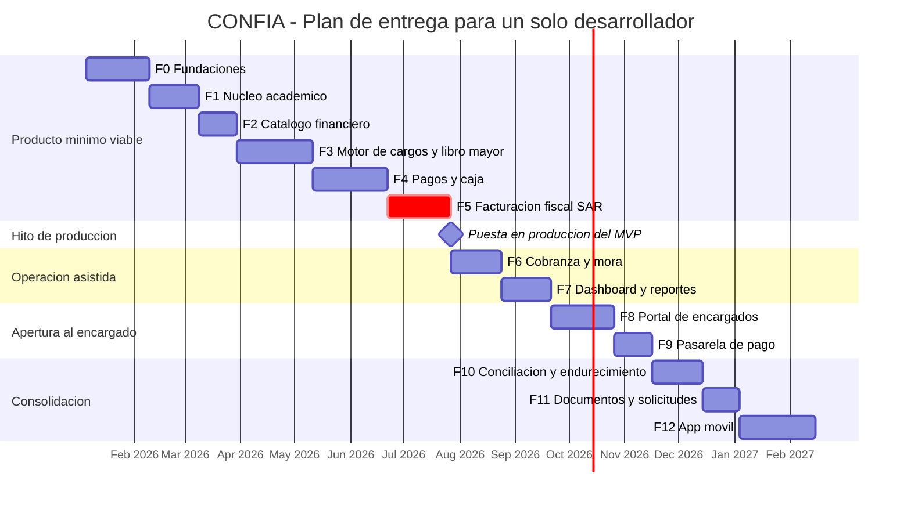

# CONFIA — Roadmap y fases

> Estado: **Propuesta v1.0** — pendiente de aprobación del propietario del producto.
> Plan de entrega dimensionado para **un solo desarrollador**. No existe paralelismo entre fases.
> Las duraciones son de trabajo efectivo a tiempo completo, no de calendario.

---

## 1. Cómo leer este plan

| Concepto | Significado en este documento |
|---|---|
| **Semana** | Cinco días de trabajo efectivo de un desarrollador a tiempo completo, con reuniones, soporte y correcciones ya descontados |
| **Criterio de salida** | Condición verificable. Mientras no se cumpla, la fase no está terminada, aunque el código exista |
| **Entregable** | Artefacto concreto y demostrable, no una actividad |
| **Fase bloqueante** | No se inicia la siguiente hasta que la anterior cierra sus criterios de salida |

Cada fase se ejecuta con el ciclo SDD completo descrito en `docs/13-metodologia-sdd.md`:
explorar, proponer, especificar, diseñar, tareas, aplicar, verificar, archivar.

---

## 2. Resumen de fases

| Fase | Nombre | Semanas | Acumulado | ¿Producción? |
|---|---|---|---|---|
| F0 | Fundaciones | 5 | 5 | No |
| F1 | Núcleo académico | 4 | 9 | No |
| F2 | Catálogo financiero | 3 | 12 | No |
| F3 | Motor de cargos y libro mayor | 6 | 18 | No |
| F4 | Pagos y caja | 6 | 24 | No |
| F5 | Facturación fiscal SAR | 5 | 29 | **Sí. Producto mínimo viable** |
| F6 | Cobranza y mora | 4 | 33 | Sí |
| F7 | Dashboard y reportes | 4 | 37 | Sí |
| F8 | Portal de encargados | 5 | 42 | Sí |
| F9 | Pasarela de pago | 3 | 45 | Sí |
| F10 | Conciliación bancaria y endurecimiento | 4 | 49 | Sí |
| F11 | Documentos y solicitudes | 3 | 52 | Sí |
| F12 | App móvil | 6 | 58 | Sí |

**Total: 58 semanas de trabajo efectivo a tiempo completo.**

### Rango honesto de calendario

| Escenario | Estimación | Supuestos |
|---|---|---|
| Tiempo completo, sin imprevistos | 58 semanas, cerca de **13 meses** | Dedicación exclusiva, decisiones del cliente sin demora, dependencias externas disponibles a tiempo |
| Tiempo completo, con margen realista del 20 % | **70 semanas, cerca de 16 meses** | Es la cifra que debe comunicarse al cliente |
| **Tiempo parcial (media jornada)** | **116 a 140 semanas, entre 27 y 32 meses** | Al partir la jornada el rendimiento no se divide entre dos: se pierde tiempo en recuperar contexto. La duplicación es el piso, no el techo |
| Producto mínimo viable a tiempo completo | 29 semanas, cerca de **7 meses** más margen: **8 meses** | Es la fecha que realmente importa negociar |
| Producto mínimo viable a tiempo parcial | Entre 14 y 16 meses | Cifra a considerar si la dedicación no es exclusiva |

No se estima por debajo de estos números. Un plan comprometido a la baja se paga con deuda
técnica en el módulo financiero, que es exactamente donde no se puede pagar.

---

## 3. Detalle por fase

### F0 — Fundaciones

| Campo | Contenido |
|---|---|
| **Objetivo** | Dejar montada la maquinaria que hace posible construir un sistema financiero sin acumular deuda: monorepo, seguridad, auditoría, idempotencia, respaldos y despliegue |
| **Duración** | 5 semanas |
| **Módulos que toca** | `identity`, `shared/audit`, `shared/security`, `shared/observability`, módulo de núcleo del backend (`kernel`), `packages/contracts` (generado), `packages/ui`, `packages/config`, `infra/` |
| **Brechas que cierra** | B6, B7 (infraestructura), B9 (diseño), B10, A7 |

**Entregables:**

1. Monorepo con `pnpm workspaces` y Turborepo, con el backend como proyecto Maven con Maven Wrapper en `apps/api`. Reglas de dependencia verificadas por ArchUnit y Spring Modulith en el backend, y por `dependency-cruiser` y ESLint en el frontend. Generación del OpenAPI y de `packages/contracts` con orval como paso obligatorio de la construcción. Medición del consumo real de memoria de los tres procesos de la JVM con los límites de Docker Compose (ADR-0013). Una violación rompe la construcción.
   **Pendientes heredados del cambio 1 (`maven-workspace-and-ci-skeleton`, archivado el
   2026-09-17):** (a) hallazgo W2: el escenario «Cada módulo usa solo su propio dominio» de
   `openspec/specs/build-integrity/spec.md` quedó diferido a los cambios 4
   (`institution-root-and-multitenancy-baseline`) y 7 (`staff-authentication-mfa-sessions`); el
   cambio 7 es el que introduce el segundo módulo de negocio y puede demostrarlo; (b) el cambio 4
   dispara el rojo programado de ADR-0018: al existir el primer módulo de negocio,
   `EmptyShouldExceptionInventoryTest` exige retirar `allowEmptyShould(true)` de
   `LayeredArchitectureTest` y su entrada del inventario, y su `tasks.md` debe preverlo.
   **Pendiente heredado del cambio 2 (`kernel-money-value-object`, decisión D3 del 2026-09-18):**
   el cambio 4 incorpora las reglas de ArchUnit de ADR-0004 §Cumplimiento 2, que prohíben `double`
   y `float` para importes y `BigDecimal.equals` fuera de `Money`.
2. Módulo de núcleo del backend con el objeto de valor `Money` (`BigDecimal` a escala cuatro con moneda explícita), reglas de redondeo y errores de dominio, con cobertura del 95 % medida con JaCoCo y pruebas de mutación con PIT.
   **Pendientes heredados del cambio 2 (`kernel-money-value-object`, archivado el 2026-09-19):**
   (a) `Money.allocate` no limita la cantidad de partes; debe acotarse antes de que los pesos
   puedan provenir de una entrada externa. (b) La validación de cadenas y de escala está duplicada
   entre `Money` y `Percentage`; se unifica cuando aparezca un tercer consumidor. (c)
   `docs/03-seguridad.md` no tiene una regla que obligue a los objetos de valor del núcleo a acotar
   la escala de un `BigDecimal` recibido del llamador; la revisión de seguridad del PR #5 tuvo que
   corregir justo esa denegación de servicio. (d) `gentle-ai sdd-archive-compose` no reconoce los
   encabezados en español (`### Requisito:`); mientras no se resuelva la incidencia
   Gentleman-Programming/gentle-ai#4797, los deltas sobre capacidades existentes se fusionan a mano
   con verificación byte a byte.
3. Autenticación del personal con MFA, roles, permisos, sesiones y bloqueo por fuerza bruta.
   **Pendientes heredados del cambio 4 (`institution-root-and-multitenancy-baseline`, archivado el
   2026-09-20):** el adaptador de `CurrentInstitutionProvider` sobre el token llega aquí y su
   fusión exige la prueba de integración que pide ADR-0009: demostrar que ninguna cabecera,
   parámetro ni cuerpo de la petición influye en la institución resuelta. Hoy ese contrato solo
   está en el Javadoc del puerto. El primer endpoint de administración de instituciones debe acotar
   el tamaño de las cadenas en su DTO con Jakarta Bean Validation (200 y 500 caracteres), para que
   un texto enorme no llegue entero al dominio; y el traductor de errores a Problem Details debe
   confirmar, antes de exponer la diferencia entre `institution-not-found` e `institution-inactive`,
   que el identificador sigue viniendo solo del token.
4. **Matriz de autorización** documentada y verificada por pruebas: qué rol puede hacer qué operación (brecha A7).
5. Bitácora de auditoría de solo inserción, encadenada por hash, sin permiso de actualización ni borrado para el rol de aplicación (brecha B6).
6. Infraestructura de idempotencia: cabecera obligatoria, índice único, respuesta reproducible (brecha B7).
7. Logs estructurados con redacción por lista de campos, métricas, trazas con OpenTelemetry.
8. Contenedores, entorno de preproducción, canalización de integración y despliegue continuo.
   **Pendiente heredado del cambio 1 (hallazgo W9):** el escaneo de dependencias **analiza los
   `pom.xml` tal como están declarados, no el árbol resuelto**. Comprobado el 2026-09-17: la misma
   dependencia vulnerable dio cero hallazgos declarada con alcance `provided` y tres, dos de ellas
   críticas, con alcance de compilación. Quedan dos consecuencias sin probar y más graves que el
   caso observado: si el alcance `test` también queda invisible, casi todo el proyecto lo estaría,
   porque todas sus declaraciones con alcance son `test` o `import`; y las dependencias
   transitivas son invisibles por definición para un análisis de lo declarado. Al armar la
   canalización completa hay que escanear un SBOM resuelto en lugar de los `pom.xml`, como
   contempla `docs/03-seguridad.md` sección 13.
   **Pendiente heredado del cambio 4 para el cambio 5 (migración de `organization_institution`):**
   la longitud de la columna del RTN hereda la guarda técnica de 1 a 20 dígitos del dominio y **no
   es una regla fiscal**; debe decirlo su propia especificación para no crear una segunda verdad
   implícita mientras `docs/04-cumplimiento-fiscal-sar.md` sección 1 siga marcando el formato como
   pendiente de validación con la contadora.
   **Pendiente heredado del cambio 5 parte A (auditoría de seguridad del 2026-09-21):** la imagen
   `postgres:18-alpine`, declarada una sola vez en la propiedad `confia.postgres.image` de
   `apps/api/pom.xml`, dejó de ser material exclusivo de prueba: la generación de código de jOOQ la
   ejecuta en cada `mvn verify`, incluida la puerta de fusión. Es una etiqueta móvil en una
   dependencia real de construcción. La fila «Imágenes base fijadas por digest» de
   `docs/03-seguridad.md` sección 13 no la alcanza literalmente, porque esa fila cubre las imágenes
   base de nuestros Dockerfiles y se verifica con Hadolint, que nunca ve una propiedad de Maven;
   pero el riesgo de cadena de suministro es el mismo. **No se fijó el dígest todavía a propósito:**
   sin un mecanismo de actualización automática, un dígest fijo congela la imagen y acumula
   vulnerabilidades conocidas en silencio, que es el riesgo inverso. Debe fijarse por dígest **en el
   mismo cambio que introduzca Renovate**, nunca antes, y esa fila de `docs/03` sección 13 debe
   ampliarse para nombrar explícitamente las imágenes de construcción y prueba, no solo las de los
   Dockerfiles.
   **Pendientes heredados del cambio 5 parte A (verificación SDD del 2026-09-21):** tres
   requisitos de `build-integrity` descansan hoy en disciplina humana y no en una puerta
   automática, y deben cerrarse con una. (a) El presupuesto de ocho minutos de la suite `*IT.java`
   se mide y se documenta, pero no se exige: `timeout-minutes: 15` cubre el trabajo `backend`
   entero, así que una suite de integración de diez minutos terminaría en verde. (b) La prueba de
   fuente única de la versión de PostgreSQL compara `PostgresIntegrationTest` contra
   `confia-build.properties`, pero no contra el otro consumidor de esa propiedad: si
   `apps/api/app/pom.xml` sustituyera `${confia.postgres.image}` por un literal divergente, ninguna
   prueba fallaría. Conviene afirmar además contra `POSTGRES.getDockerImageName()`. (c) Nada impide
   nombrar `*Test` a una clase que necesita contenedor, y por lo tanto ejecutarla en Surefire sin
   Docker; el riesgo no es teórico, porque `PostgresImageSingleSourceTest` ya vive en el mismo
   paquete `support`. **El punto (c) quedó CERRADO por la parte B del cambio 5, corte B4**
   (`IntegrationTestNamingTest`): toda subclase concreta de `PostgresIntegrationTest`, y toda clase
   que llame a `SharedPostgresContainer` y declare un método de prueba propio, debe terminar en
   `*IT`. Los puntos **(a) y (b) siguen abiertos**: el presupuesto de ocho minutos se sigue midiendo
   sin exigirse, y la prueba de fuente única sigue sin cubrir al segundo consumidor de
   `confia.postgres.image`. Falta también un fixture de violación en la capa `infrastructure` para
   el escenario de dependencia inválida. El informe completo, con la trazabilidad de los cuarenta y
   tres escenarios, queda en
   `openspec/changes/archive/2026-09-21-jooq-flyway-testcontainers-wiring/verify-report.md`.
9. Respaldo en dos niveles según ADR-0014: respaldo automático de RDS con restauración a un punto en el tiempo dentro de AWS, más respaldo lógico nocturno cifrado y copia fuera de sitio en un proveedor distinto de AWS (brecha B10).
10. Sistema de diseño base en `packages/ui` con tokens, átomos y verificación de accesibilidad automatizada.
11. Semilla de datos ficticios para desarrollo y capacitación.
12. Mecanismo de trabajos en segundo plano con db-scheduler sobre PostgreSQL (ADR-0016): tabla de tareas creada por migración de Flyway, programación dentro de la transacción del negocio a través del componente transaccional único (mecanismo validado con prueba), ejecutor solo en `confia-worker`, reintentos acotados con espera exponencial, métricas de tareas y alerta de cola atascada, y prohibiciones verificadas por ArchUnit y `maven-enforcer-plugin`.

**Criterios de salida:**

- [ ] Un intento de importar el `domain` de otro módulo rompe la construcción en integración continua.
- [ ] Un usuario sin permiso recibe 403 y el intento queda en `AuditLog`.
- [x] El verificador de cadena de auditoría detecta una manipulación inyectada en una prueba.
      **Cerrado por la parte B del cambio 5, corte B3b-i**, con
      `AuditChainVerifierIT.aRowAlteredDirectlyWithSuperuserWithoutRecalculatingIsIdentifiedExactly`:
      una conexión `SUPERUSER` real desactiva el disparador por sesión con
      `session_replication_role`, altera una fila confirmada, restaura el disparador, y el
      recorrido de producción identifica el `(institution_id, id)` exacto. Su simétrica,
      `AuditChainKnownLimitIT`, declara el límite aceptado: una manipulación que recalcula la
      cadena entera **no** se detecta mientras no exista el ancla externa del cambio 11.
- [ ] Dos solicitudes con la misma clave de idempotencia producen un solo efecto y la misma respuesta.
- [ ] Una tarea programada dentro de una transacción revertida no existe, y solo el proceso `confia-worker` ejecuta tareas.
- [ ] **Un respaldo se restaura en un entorno limpio y el acta de simulacro está firmada.**
- [ ] OpenAPI 3.1 se genera y publica como artefacto versionado.
- [ ] La verificación de accesibilidad no reporta violaciones críticas en las pantallas existentes.

**Riesgos:** sobredimensionar la infraestructura y consumir semanas en configuración que no
entrega valor visible. Mitigación: la infraestructura de F0 es la mínima que soporta un sistema
financiero, no la ideal. Docker Compose, no Kubernetes.

---

### F1 — Núcleo académico

| Campo | Contenido |
|---|---|
| **Objetivo** | Tener la matrícula de la institución dentro del sistema, con la estructura organizativa que todo lo demás usa como eje |
| **Duración** | 4 semanas |
| **Módulos que toca** | `organization`, `students`, `guardians` |
| **Requerimiento original cubierto** | Módulos 2, 3 (parcial) y 4 |

**Entregables:**

1. Institución, año lectivo, modalidad, grado, sección y períodos de cobro.
2. Estudiante con datos mínimos necesarios y cifrado de identificadores sensibles.
3. Matrícula por año lectivo, con traslado de sección y estados de matrícula.
4. Encargado de pago con vínculo a uno o varios estudiantes, parentesco y **porcentaje de responsabilidad financiera**.
5. Búsqueda y grid con paginación, orden y filtrado en servidor.
6. **Herramienta de migración** desde el sistema actual: importación validada, reporte de rechazos y acta de conciliación.
7. Registro de consentimiento para comunicaciones.

**Criterios de salida:**

- [ ] La matrícula completa del año lectivo vigente está cargada y conciliada contra el listado oficial de la institución, con acta firmada.
- [ ] Un estudiante no puede tener dos matrículas activas en el mismo año lectivo (INV-31).
- [ ] La suma de porcentajes de responsabilidad financiera de un estudiante es exactamente 100 (INV-32).
- [ ] Toda alta, cambio y baja de estudiante escribe en la bitácora de auditoría.

**Riesgos:** la calidad de los datos del sistema actual. Es el riesgo R11 del registro. Mitigación:
la migración se ejecuta en modo simulación tantas veces como haga falta antes de escribir, y el
reporte de rechazos se revisa con la administración registro por registro.

---

### F2 — Catálogo financiero

| Campo | Contenido |
|---|---|
| **Objetivo** | Definir qué se cobra, cuánto cuesta en cada momento y qué beneficios lo reducen, sin destruir la historia |
| **Duración** | 3 semanas |
| **Módulos que toca** | `catalog`, `scholarships` |
| **Brechas que cierra** | B3 |
| **Requerimiento original cubierto** | Módulos 5 y 6 |

**Entregables:**

1. Conceptos de pago con categoría, recurrencia y condición de gravado.
2. **Listas de precios con vigencia desde y hasta.** Un precio no se edita: se crea una nueva vigencia (brecha B3).
3. Tasas de impuesto con vigencia.
4. Becas institucionales con cobertura por concepto, porcentaje o monto fijo, y tope por período.
5. Otorgamiento de beca a un estudiante con vigencia y aprobación registrada.
6. Descuentos por campaña, pronto pago o convenio, con regla de acumulación explícita.
7. Simulador: dado un estudiante y un período, mostrar el monto resultante con beneficios aplicados.

**Criterios de salida:**

- [ ] Dos vigencias del mismo concepto en la misma lista no pueden solaparse. La base de datos lo rechaza (INV-11).
- [ ] Un cambio de precio genera una vigencia nueva y no altera ningún cargo emitido.
- [ ] El simulador reproduce exactamente el cálculo que hará el motor de devengo en F3.
- [ ] Un beneficio no puede reducir el monto por debajo de cero (INV-15).

**Riesgos:** la institución puede tener reglas de beca implícitas que nadie documentó. Mitigación:
sesión de trabajo con la administración recorriendo casos reales antes de especificar.

---

### F3 — Motor de cargos y libro mayor

| Campo | Contenido |
|---|---|
| **Objetivo** | El corazón del sistema. Devengo automático de cargos y contabilidad de doble partida inmutable |
| **Duración** | 6 semanas |
| **Módulos que toca** | `charges`, `ledger` |
| **Brechas que cierra** | B1, B2 |

**Entregables:**

1. Libro mayor de doble partida: `LedgerTransaction`, `LedgerEntry`, `LedgerAccount`, cuentas por estudiante (brecha B1).
2. Asientos inmutables. Sin permiso de actualización ni borrado para el rol de aplicación.
3. Reversos: toda corrección es un asiento nuevo que referencia al original.
4. Derivación del saldo desde el libro. Saldo cacheado solo como optimización, reconstruido en trabajo nocturno.
5. **Trabajo nocturno de integridad**: verifica que toda transacción cuadre y que el saldo cacheado coincida con el derivado. Una divergencia genera alerta.
6. Planes de cobro por modalidad, grado o sección, con periodicidad y día de vencimiento.
7. **Motor de devengo idempotente**: genera los cargos del período aplicando precios vigentes, becas y descuentos, y registra el resultado en el libro (brecha B2).
8. Cargos manuales con motivo obligatorio y aprobación.
9. Estado de cuenta del estudiante calculado y consultable desde el panel administrativo.
10. Ajustes administrativos con motivo y aprobador distinto del solicitante.

**Criterios de salida:**

- [ ] Ejecutar el motor de devengo dos veces sobre el mismo período produce el mismo conteo de cargos. Cero duplicados (INV-14).
- [ ] La suma de débitos iguala la suma de créditos en el 100 % de las transacciones (INV-01).
- [ ] Un intento de actualizar o borrar una transacción publicada es rechazado por la base de datos (INV-04).
- [ ] Un cargo reversado deja rastro completo: original, reverso y motivo.
- [ ] El saldo de un estudiante con 12 meses de historial simulada se reconstruye exactamente desde cero.
- [ ] Pruebas de dominio con casos límite: cero, redondeo, moneda distinta, concurrencia.

**Riesgos:** es la fase con mayor densidad conceptual. Un error aquí contamina todo lo posterior.
Mitigación: cobertura del 95 % en el módulo de núcleo y en el paquete `domain` de cada módulo,
pruebas de mutación con umbral 80, y revisión
adversarial del diseño antes de escribir código.

---

### F4 — Pagos y caja

| Campo | Contenido |
|---|---|
| **Objetivo** | Cobrar. Y controlar el efectivo que se cobra |
| **Duración** | 6 semanas |
| **Módulos que toca** | `payments`, `cashbox` |
| **Brechas que cierra** | B4, B7 (aplicación), B8 (estados declarado y confirmado), A6 |
| **Requerimiento original cubierto** | Módulo 7 |

**Entregables:**

1. Registro de pago en efectivo, tarjeta y transferencia declarada.
2. Aplicación del pago a cargos: automática por antigüedad o manual por selección.
3. Pagos parciales y abonos.
4. **Estados `declared` y `confirmed`**: una transferencia notificada no equivale a dinero confirmado (preparación de B8).
5. **Sesiones de caja**: apertura con fondo inicial, movimientos, cierre con conteo declarado frente a esperado, diferencia justificada y aprobada, reporte imprimible (brecha B4).
6. Bloqueo de cobro en efectivo fuera de sesión abierta.
7. Idempotencia aplicada a toda escritura financiera, con bloqueo de reenvío en la interfaz (brecha B7).
8. **Saldos a favor y reembolsos**: aplicar a deuda futura, transferir a un hermano o reembolsar, cada uno con su asiento (brecha A6).
9. Reverso de pago con motivo y aprobación.
10. Comprobante interno imprimible, previo a la factura fiscal de F5.
11. **Manual de usuario del cajero** y ambiente de práctica con datos ficticios.

**Criterios de salida:**

- [ ] No se puede registrar un pago en efectivo sin sesión de caja abierta (INV-20). Verificado por prueba de extremo a extremo.
- [ ] Un usuario no puede tener dos sesiones abiertas a la vez (INV-22).
- [ ] Un cierre con diferencia distinta de cero exige motivo y aprobador distinto del cajero (INV-23).
- [ ] Una aplicación de pago no puede exceder el saldo pendiente del cargo (INV-17).
- [ ] Un doble envío con la misma clave de idempotencia produce un solo cobro (INV-24).
- [ ] El registro completo de un pago se ejecuta en 90 segundos o menos, medido con un cajero real (OB-01).
- [ ] Al menos dos cajeros ejecutan el flujo completo sin asistencia del desarrollador.

**Riesgos:** resistencia del personal al control de caja, que se percibe como desconfianza.
Mitigación: presentar el arqueo como protección del cajero honesto, que hasta hoy no puede
demostrar su inocencia ante un faltante. Es el riesgo R10.

---

### F5 — Facturación fiscal SAR

| Campo | Contenido |
|---|---|
| **Objetivo** | Emitir documentos fiscales válidos y poder corregirlos legalmente. Es la última puerta antes de producción |
| **Duración** | 5 semanas |
| **Módulos que toca** | `invoicing` |
| **Brechas que cierra** | B5, A5 |
| **Requerimiento original cubierto** | Módulos 3 (facturación) y 10 |

> **Advertencia.** Toda regla fiscal concreta de este módulo, incluidos plazos de anulación,
> formato del documento impreso, leyendas obligatorias y tratamiento del impuesto sobre ventas,
> **debe ser validada con el contador de la institución y contra la normativa vigente del SAR**
> antes de implementarse. Este roadmap no sustituye asesoría fiscal.

**Entregables:**

1. Puntos de emisión y rangos CAI con rango de correlativos y fecha límite.
2. Asignación de correlativo por secuencia con bloqueo y aislamiento serializable. Nunca `MAX(...) + 1`.
3. Emisión de factura a partir de un pago confirmado, con datos del receptor, líneas de detalle, descuentos e impuestos.
4. Documento fiscal inmutable: sin actualización ni borrado, con hash de contenido verificable.
5. **Anulación** con motivo y autorización de un rol distinto del emisor (brecha B5).
6. **Notas de crédito** total y parcial, con referencia a la factura original y asiento en el libro mayor (brecha B5).
7. **Panel de control de rangos CAI**: consumo porcentual, días restantes, alerta configurable y bloqueo controlado antes del agotamiento (brecha A5).
8. Reporte de continuidad de correlativos: todo hueco explicado por una anulación registrada.
9. Libro de ventas del período, exportable.
10. Generación y archivado del PDF fiscal en almacenamiento compatible con S3.

**Criterios de salida:**

- [ ] Un documento emitido no puede modificarse ni borrarse. La base de datos lo rechaza (INV-25).
- [ ] El correlativo es único por punto de emisión y nunca se reutiliza, ni tras una anulación (INV-26).
- [ ] Una emisión con CAI vencido o fuera de rango es rechazada (INV-27).
- [ ] Una nota de crédito no puede acreditar más que el saldo no acreditado de la factura original (INV-29).
- [ ] El reporte de continuidad muestra cero huecos sin justificación.
- [ ] **El contador de la institución valida por escrito una factura, una anulación y una nota de crédito reales.**
- [ ] Prueba de concurrencia: 50 emisiones simultáneas producen 50 correlativos consecutivos sin colisión.

**Riesgos:** dependencia total del SAR y del contador. Si el rango CAI no está disponible o las
reglas se malinterpretan, la fase no cierra. Es el riesgo R02. Mitigación: validar las reglas
fiscales con el contador **antes** de especificar, no al final.

---

### F6 — Cobranza y mora

| Campo | Contenido |
|---|---|
| **Objetivo** | Pasar de una cobranza reactiva a una gestión sistemática, con evidencia de haber notificado |
| **Duración** | 4 semanas |
| **Módulos que toca** | `collections`, `notifications` |
| **Brechas que cierra** | A1, A2 |
| **Requerimiento original cubierto** | Módulos 8 y 9 |

**Entregables:**

1. **Motor de mora configurable**: días de gracia, recargo fijo o porcentual, tope máximo, capitalización o no, exención por beca (brecha A1).
2. Suspensión del recargo durante una promesa de pago vigente.
3. Cálculo determinista y reproducible, con explicación desglosada para el reclamo de un padre.
4. Promesas de pago: registro, historial, alertas de incumplimiento y reactivación del recargo al romperse.
5. **Abstracción de canal** con adaptadores para correo, mensajería y SMS (brecha A2).
6. Plantillas versionadas por canal e idioma.
7. **Bitácora de entrega**: cada envío con su estado, control de rebotes, límite de frecuencia por destinatario y mecanismo de baja.
8. Escalamiento configurable de avisos por etapa de atraso.
9. Baja de cartera (incobrable) con aprobación y asiento contable.

**Criterios de salida:**

- [ ] El cálculo de mora de un caso real se explica línea por línea y coincide con lo que la administración esperaba.
- [ ] Un recargo no se aplica sin evidencia previa de notificación entregada (OB-10).
- [ ] Una promesa activa suspende el recargo; al romperse, el recargo se recalcula desde el vencimiento original.
- [ ] Recorrer el proceso de mora dos veces en el mismo día no duplica recargos.
- [ ] El dominio de correo está verificado con SPF, DKIM y DMARC, y los rebotes se registran.

**Riesgos:** un error de cálculo de mora reclamado por un padre daña la confianza en el sistema
completo. Es el riesgo R14. Mitigación: el cálculo vive en el paquete `domain` del módulo
`collections`, con cobertura del
95 %, pruebas de mutación, y una vista de desglose que la administración puede mostrar al padre.

---

### F7 — Dashboard y reportes

| Campo | Contenido |
|---|---|
| **Objetivo** | Convertir los datos en decisiones. Es el entregable que justifica el sistema ante la dirección |
| **Duración** | 4 semanas |
| **Módulos que toca** | `reporting` |
| **Brechas que cierra** | A3, M4 |
| **Requerimiento original cubierto** | Módulos 11 y 12 |

**Entregables:**

1. Dashboard gerencial con filtros por fecha, modalidad y grado: recaudación del período, cartera vigente, morosidad, efectivo del día, consumo de rango CAI.
2. Reporte de antigüedad de saldos por tramos.
3. Tasa de morosidad por grado, modalidad y sección.
4. **Proyección de recaudación y cartera esperada del período** (brecha M4).
5. Reporte de recaudación por cajero, por método de pago y por concepto.
6. Libro de ventas y reporte de facturación para contabilidad.
7. **Exportación contable**: mapeo de conceptos a cuentas contables y generación de pólizas en el formato que consume el sistema contable de la institución (brecha A3).
8. Exportación a CSV, Excel y PDF con vistas guardadas y filtros compartibles por URL.

**Criterios de salida:**

- [ ] Los totales del dashboard coinciden exactamente con los del libro mayor para el mismo período.
- [ ] La exportación contable es aceptada e importada sin ajustes manuales por el sistema contable de la institución.
- [ ] Un reporte de 12 meses de historial se genera en menos de 10 segundos.
- [ ] Los reportes se ejecutan sin degradar la operación de cobro, sobre vistas materializadas o réplica.

**Riesgos:** consultas pesadas que degradan la operación transaccional. Mitigación: reportes sobre
vistas materializadas refrescadas fuera de horario, y en fase posterior sobre réplica de lectura.

---

### F8 — Portal de encargados

| Campo | Contenido |
|---|---|
| **Objetivo** | Que el encargado consulte su estado de cuenta sin llamar ni presentarse. Primera exposición del sistema a internet abierto |
| **Duración** | 5 semanas |
| **Módulos que toca** | `portal`, `guardians`, más el perfil de despliegue `confia-api-portal` |
| **Brechas que cierra** | A8, B9 (autoservicio) |

**Entregables:**

1. Proceso de despliegue independiente con solo el módulo `portal` cargado en memoria.
2. **Rol de PostgreSQL separado y mínimo**, sin acceso a tablas de usuarios, rangos CAI, sesiones de caja ni auditoría.
3. **Seguridad a nivel de fila** que filtra por el encargado en sesión, aplicada en el motor.
4. Dominio de identidad separado: tablas propias, claves de firma y audiencia de token distintas, cookies sin superposición de alcance (brecha A8).
5. Registro validado contra el vínculo encargado y estudiante, verificación de correo, recuperación de contraseña segura, MFA opcional, bloqueo independiente.
6. Estado de cuenta consultable, historial de pagos y descarga de comprobantes y facturas.
7. Autoservicio de datos personales: exportación y rectificación a solicitud del titular (brecha B9).
8. Limitación de tasa agresiva, cortafuegos de aplicación y política de seguridad de contenido propia.
9. Interfaz responsiva y accesible nivel AA, pensada para teléfono.

**Criterios de salida:**

- [ ] **Prueba de integración obligatoria**: un encargado no puede leer datos de un estudiante que no le corresponde, ni siquiera forzando el identificador (INV-34).
- [ ] El proceso del portal no expone ninguna ruta administrativa. Verificado contra el OpenAPI generado por perfil.
- [ ] Un token del portal es criptográficamente inválido contra la API administrativa.
- [ ] Revisión de seguridad del portal completada, con las observaciones altas y críticas resueltas.
- [ ] El estado de cuenta se genera en 10 segundos o menos (OB-04).

**Riesgos:** es la superficie de mayor exposición del sistema. Es el riesgo R05. Mitigación: el
aislamiento no depende del código de aplicación sino del rol de base de datos y de la seguridad a
nivel de fila. Revisión de seguridad dedicada antes de publicar.

---

### F9 — Pasarela de pago

| Campo | Contenido |
|---|---|
| **Objetivo** | Que el encargado pague en línea, sin que el sistema toque nunca datos de tarjeta |
| **Duración** | 3 semanas |
| **Módulos que toca** | `payments`, `portal` |
| **Brechas que cierra** | A9 |

**Entregables:**

1. Integración con **página alojada o campos alojados** del proveedor. El formulario de tarjeta nunca vive en el portal (brecha A9).
2. Verificación de firma del webhook y rechazo de mensajes no firmados.
3. Idempotencia sobre el webhook: un reenvío del proveedor no cobra dos veces.
4. Transición automática del pago a `confirmed` al recibir la confirmación válida.
5. Emisión automática del documento fiscal tras la confirmación.
6. Conciliación de la liquidación del proveedor contra los pagos registrados.
7. Manejo explícito de pagos pendientes, rechazados y en disputa.

**Criterios de salida:**

- [ ] El alcance de cumplimiento queda en el cuestionario de autoevaluación más simple, documentado por escrito.
- [ ] Un webhook reenviado cinco veces produce un solo pago.
- [ ] Un webhook con firma inválida se rechaza y queda registrado.
- [ ] La liquidación del proveedor cuadra con los pagos del período.

**Riesgos:** dependencia total del banco y de su documentación. Es el riesgo R08. Mitigación: no
se inicia la fase sin credenciales de prueba funcionando y sin la documentación del webhook en la
mano. Si el banco no responde, la fase se pospone y se avanza F10.

---

### F10 — Conciliación bancaria y endurecimiento

| Campo | Contenido |
|---|---|
| **Objetivo** | Que la cartera del sistema y el saldo real del banco coincidan. Y dejar el sistema listo para operar sin el desarrollador presente |
| **Duración** | 4 semanas |
| **Módulos que toca** | `reconciliation`, `shared/security`, `shared/observability`, `infra/` |
| **Brechas que cierra** | B8 |

**Entregables:**

1. Importación del estado de cuenta bancario con validación de formato y hash del archivo (brecha B8).
2. **Motor de emparejamiento automático** por monto, fecha y referencia, con puntaje de confianza.
3. Cola de partidas no conciliadas con flujo de investigación y emparejamiento manual.
4. Confirmación automática del pago declarado al conciliarse.
5. Reporte de conciliación del período con partidas pendientes de ambos lados.
6. **Endurecimiento**: revisión de seguridad completa, rotación de secretos, cabeceras de borde, pruebas de carga con k6.
7. **Transferencia tecnológica**: runbooks de incidentes, documentación de operación, sesiones de traspaso grabadas con el departamento de sistemas de la institución.
8. Simulacro de recuperación ante desastre completo, con acta.

**Criterios de salida:**

- [ ] Un mes real de estado de cuenta bancario se concilia con menos del 5 % de partidas requiriendo intervención manual.
- [ ] Un pago declarado que no aparece en el banco no se confunde con dinero confirmado.
- [ ] **Al menos una persona del departamento de sistemas ejecuta el runbook de restauración sin el desarrollador.**
- [ ] Las pruebas de carga sostienen el pico de inicio de período sin degradación.
- [ ] La revisión de seguridad no deja observaciones críticas ni altas abiertas.

**Riesgos:** el formato del estado de cuenta bancario puede ser inestable o difícil de procesar.
Mitigación: adaptador por formato, con importación manual como respaldo permanente.

---

### F11 — Documentos y solicitudes

| Campo | Contenido |
|---|---|
| **Objetivo** | Que el encargado solicite constancias y envíe justificaciones sin presentarse a la institución |
| **Duración** | 3 semanas |
| **Módulos que toca** | `documents`, `portal`, `notifications` |
| **Brechas que cierra** | A4 |

**Entregables:**

1. Tipos de documento configurables: constancia de matrícula, de pago, de conducta, certificaciones.
2. Solicitud desde el portal con adjuntos, para justificaciones de inasistencia.
3. Flujo de estados con asignación a un responsable y plazo de atención.
4. Plantillas de documento y generación de PDF con **folio verificable** mediante enlace público de verificación.
5. Regla configurable que condiciona la emisión a la ausencia de saldo vencido.
6. Bitácora completa de solicitudes y entregas.
7. Notificación al encargado en cada cambio de estado.

**Criterios de salida:**

- [ ] Un documento emitido se verifica públicamente por su folio sin exponer datos personales adicionales.
- [ ] El flujo completo, desde la solicitud hasta la entrega, ocurre sin intervención por correo fuera del sistema.
- [ ] Los adjuntos se almacenan cifrados y respetan la política de retención.

**Riesgos:** expansión del alcance hacia gestión académica completa. Mitigación: la lista de tipos
de documento se cierra por escrito al inicio de la fase.

---

### F12 — App móvil

| Campo | Contenido |
|---|---|
| **Objetivo** | Llevar el portal al teléfono del encargado, con notificaciones push |
| **Duración** | 6 semanas |
| **Módulos que toca** | `apps/mobile`, `packages/contracts`, `notifications` |

**Entregables:**

1. Aplicación con Expo y React Native para iOS y Android, consumiendo el mismo contrato de API.
2. Autenticación con biometría opcional sobre el dominio de identidad del portal.
3. Estado de cuenta, historial, descarga de comprobantes y pago en línea.
4. Solicitudes de documentos y justificaciones.
5. Notificaciones push con el mismo motor de plantillas y bitácora de entrega.
6. Publicación en ambas tiendas y proceso de actualización.
7. Cierre de la transferencia tecnológica.

**Criterios de salida:**

- [ ] La app no contiene ninguna regla de negocio financiero. Todo cálculo proviene de la API.
- [ ] Las tiendas aprueban la publicación, incluidas las declaraciones de privacidad de datos de menores.
- [ ] Un cambio incompatible en el contrato rompe la construcción del monorepo antes de llegar a producción.

**Riesgos:** los procesos de revisión de las tiendas son lentos e impredecibles, y las políticas
sobre datos de menores son estrictas. Mitigación: preparar las declaraciones de privacidad desde
el inicio de la fase, no al final.

---

## 4. Diagrama de Gantt

Fechas ilustrativas a tiempo completo, con inicio en enero. Sirven para ver la secuencia y las
dependencias, no como compromiso contractual.

---

## 5. Hitos con demostración al cliente

Cada hito es una sesión de trabajo con el propietario del producto y el personal que usará el
módulo. No es una presentación de diapositivas: es el sistema funcionando con datos de la
institución. De cada sesión sale un acta con las observaciones y su clasificación.

| Hito | Al cierre de | Qué se demuestra | Quién debe estar presente |
|---|---|---|---|
| **H1. Cimientos visibles** | F0 | Inicio de sesión con MFA, roles y permisos, bitácora de auditoría, restauración de un respaldo en vivo | Propietario, departamento de sistemas |
| **H2. La institución dentro del sistema** | F1 | Matrícula real cargada, búsqueda, vínculo de encargados, acta de conciliación de la migración | Propietario, coordinación académica, administración |
| **H3. Qué se cobra y cuánto** | F2 | Catálogo, cambio de precio creando vigencia nueva, beca aplicada, simulador | Propietario, administración, contabilidad |
| **H4. La deuda existe sola** | F3 | Generación automática de cargos del mes, estado de cuenta derivado del libro, reverso de un cargo | Propietario, administración, contabilidad |
| **H5. Cobrar y cuadrar** | F4 | Cobro completo en ventanilla, cierre de caja con arqueo y reporte impreso | Propietario, cajeros, administración |
| **H6. Facturar legalmente** | F5 | Emisión con CAI, anulación, nota de crédito, panel de rangos | Propietario, contabilidad, **contador de la institución** |
| **H7. Cobranza que se explica** | F6 | Cálculo de mora desglosado, aviso enviado con evidencia, promesa de pago | Propietario, administración |
| **H8. La dirección ve el negocio** | F7 | Dashboard gerencial, antigüedad de saldos, exportación contable importada | **Dirección**, contabilidad |
| **H9. El padre se autoatiende** | F8 | Registro, verificación, consulta de estado de cuenta desde un teléfono real | Propietario, administración, un encargado voluntario |
| **H10. Pago en línea** | F9 | Pago completo con tarjeta desde el portal, factura emitida automáticamente | Propietario, contabilidad, banco |
| **H11. El sistema opera sin mí** | F10 | Conciliación de un mes real, restauración ejecutada por el departamento de sistemas | Propietario, departamento de sistemas |
| **H12. Trámites en línea** | F11 | Solicitud de constancia y entrega con folio verificable | Propietario, secretaría académica |
| **H13. En el teléfono** | F12 | App publicada, notificación push recibida, pago realizado | Propietario, dirección |

---

## 6. Trabajo continuo transversal

Estas actividades no son una fase. Ocurren en todas, y su tiempo ya está descontado dentro de las
duraciones declaradas. Si se recortan, la deuda aparece en el peor momento posible.

| Actividad | Cadencia | Entregable verificable |
|---|---|---|
| **Documentación viva** | En cada cambio SDD | Los documentos de `docs/` se actualizan en el mismo pull request que el código. Un cambio que los contradice no se fusiona |
| **Manuales técnicos de diseño lógico y físico** | Congelados al cierre de cada fase | Diagrama entidad-relación, diccionario de datos generado desde el esquema, OpenAPI publicado, documento de arquitectura vigente |
| **Manuales de usuario por rol** | Desde F4, actualizados por fase | Manual del cajero, del administrador, de contabilidad y del coordinador. Videos cortos por flujo |
| **Capacitación al personal** | Desde F4, antes de cada puesta en producción | Sesiones registradas, ambiente de práctica con datos ficticios, lista de asistencia |
| **Transferencia tecnológica** | Desde F0, intensiva en F10 y F12 | Runbooks de operación e incidentes, acceso al repositorio, sesiones de traspaso grabadas. **No se deja para el final** |
| **Respaldos y simulacro de restauración** | Respaldo diario, simulacro mensual | Acta de simulacro firmada con tiempos reales medidos contra los objetivos declarados |
| **Seguridad** | Análisis en cada construcción, revisión formal por fase con exposición externa | Dependencias sin vulnerabilidades críticas, análisis estático limpio, revisión dedicada antes de F8 y F9 |
| **Registro de decisiones de arquitectura** | Ante cada decisión estructural | Un ADR nuevo en `docs/adr/`. Una decisión sin ADR no existe |
| **Registro de riesgos** | Revisión mensual | `docs/11-riesgos.md` actualizado con exposición recalculada y estado de cada mitigación |
| **Verificación de accesibilidad** | En cada pantalla nueva | axe-core en integración continua, sin violaciones críticas |
| **Gestión de deuda técnica** | Reserva del 10 % de cada fase | Lista priorizada. Ningún elemento del núcleo financiero permanece en la lista más de una fase |

---

## 7. Producto mínimo viable

**El producto mínimo viable es F0 a F5. Antes de F5 el sistema no debe ponerse en producción.**

### Por qué ese es el corte

Con F0 a F5 la institución puede operar su ciclo financiero completo de principio a fin: tiene su
matrícula, su catálogo con precios históricamente correctos, sus cargos generados
automáticamente, un libro mayor que garantiza que las cuentas cuadran, cobro en ventanilla con
control de efectivo, y facturación fiscal válida con capacidad de corregir errores legalmente.
Eso ya reemplaza el proceso manual y entrega el valor central del sistema.

### Por qué no antes

| Si se pone en producción al cierre de | Qué falta y qué ocurre |
|---|---|
| **F1** | No hay cargos ni pagos. El sistema es un directorio de estudiantes. No entrega valor financiero |
| **F2** | Hay catálogo pero nadie debe nada. No existe cartera |
| **F3** | Existe la deuda, pero no se puede cobrar dentro del sistema. El cobro seguiría siendo manual y divergiría del libro desde el primer día |
| **F4** | **Se cobra pero no se factura.** La institución quedaría cobrando sin emitir el documento fiscal correspondiente, o emitiéndolo en un sistema paralelo. Se genera de inmediato una divergencia entre lo cobrado y lo facturado, que es exactamente el problema que el sistema viene a resolver. Además, al no existir aún notas de crédito, el primer error de cobro no tendría corrección legal posible y obligaría a manipular datos a mano |

El punto de F5 no es la factura: es la **capacidad de corregir**. Un sistema financiero en
producción sin nota de crédito ni anulación no es un sistema incompleto, es una trampa. El primer
error obliga a abrir la base de datos, y a partir de ese momento ninguna cifra del sistema es
defendible ante una auditoría.

### Qué se acepta conscientemente al salir en F5

| Limitación temporal | Cómo se opera mientras tanto | Se resuelve en |
|---|---|---|
| La cobranza es manual | La administración usa el reporte de vencidos y notifica por sus medios actuales | F6 |
| Los reportes gerenciales son básicos | Se usan las exportaciones a CSV y Excel del período | F7 |
| Los encargados consultan por teléfono o en ventanilla | Se emite el estado de cuenta en PDF desde el panel | F8 |
| Las transferencias se registran como declaradas | Contabilidad verifica manualmente contra el banco antes de confirmar | F10 |
| No hay pago en línea | Se cobra en ventanilla y por transferencia notificada | F9 |

Estas limitaciones son operativamente tolerables. La ausencia de control de caja, de libro mayor
o de nota de crédito **no lo es**, y por eso F3, F4 y F5 son condición de salida a producción.

---

## 8. Documentos relacionados

| Documento | Contenido |
|---|---|
| `docs/00-vision-y-alcance.md` | Alcance, actores y criterios de éxito |
| `docs/01-arquitectura.md` | Fuente de verdad técnica |
| `docs/02-modelo-de-dominio.md` | Entidades, invariantes y máquinas de estado |
| `docs/10-analisis-de-brechas.md` | Brechas y su fase de resolución |
| `docs/11-riesgos.md` | Registro de riesgos referenciado en cada fase |
| `docs/13-metodologia-sdd.md` | Ciclo de desarrollo dirigido por especificaciones |
