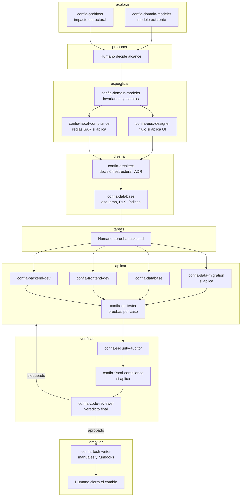

# CONFIA — Agentes y herramientas

> Guía de uso de los agentes especializados del proyecto, ubicados en `.claude/agents/`, y de los
> comandos disponibles en `.claude/commands/`.
> Subordinado a `docs/01-arquitectura.md` y a `CLAUDE.md`. Si algo aquí contradice esos documentos,
> ganan ellos.

CONFIA se construye con **trece agentes especializados**. Cada uno tiene un alcance angosto a
propósito: con un solo desarrollador, la disciplina de delegación no es organización de equipo, es
la forma de mantener cada decisión dentro de su dominio de experticia y de evitar que una sesión de
trabajo mezcle arquitectura, seguridad, dinero y estilo de interfaz sin ningún filtro.

---

## 1. Tabla de agentes

| Agente | Propósito | Cuándo invocarlo | Qué NO le corresponde | Modelo |
|---|---|---|---|---|
| `confia-architect` | Decisiones de arquitectura, ADR, impacto estructural | Dónde vive un módulo, si una comunicación es por caso de uso o evento, validar aislamiento panel/portal | Implementar código, modelar dominio, aprobar SDD | opus |
| `confia-domain-modeler` | Agregados, invariantes, máquinas de estado, libro mayor | Modelar una regla de negocio nueva antes de implementarla, definir eventos de dominio | Arquitectura de despliegue, código con framework, migraciones | opus |
| `confia-database` | Migraciones de Flyway, índices, RLS | Crear o cambiar tablas, declarar restricciones, diseñar políticas de fila, revisar plan de ejecución | Modelar dominio, escribir casos de uso, reglas fiscales | opus |
| `confia-backend-dev` | Implementación de `apps/api` (Java con Spring Boot), incluido el módulo de núcleo; OpenAPI del que se genera `packages/contracts` | Escribir un módulo de negocio de Spring Boot, un caso de uso, un adaptador, aplicar idempotencia y auditoría | Decidir arquitectura o modelo, migraciones, reglas fiscales, autoaprobación | sonnet |
| `confia-frontend-dev` | Implementación de `admin-web`, `portal-web`, `packages/ui` | Construir una pantalla, un componente, una tabla o un formulario ya diseñados | Diseñar el flujo, decidir contrato de API, calcular dinero en el cliente | sonnet |
| `confia-uiux-designer` | Flujos, wireframes en texto, sistema de diseño, accesibilidad | Diseñar una pantalla o un patrón de interacción antes de construirlo, revisar una interfaz existente | Escribir componentes React, decidir contrato de API o reglas de negocio | opus |
| `confia-security-auditor` | Modelado de amenazas, verificación de controles, auditoría de dependencias | Revisar seguridad antes de fusionar, evaluar el impacto de un cambio sensible | Escribir o corregir código, aprobar la fusión por sí solo | opus |
| `confia-fiscal-compliance` | Reglas de facturación SAR: CAI, correlativos, impuestos, notas de crédito | Cualquier duda de facturación fiscal hondureña, revisar un cambio que toque `invoicing` | Modelar el libro mayor en general, implementar código, inventar una regla no confirmada | opus |
| `confia-qa-tester` | Estrategia y escritura de pruebas en todos los niveles | Escribir pruebas unitarias, de integración, de RLS, de concurrencia, o reproducir un defecto | Implementar la funcionalidad, decidir la regla o el esquema que prueba | sonnet |
| `confia-devops` | Contenedores, integración continua, respaldo, endurecimiento | Escribir o revisar Dockerfiles, flujos de CI, procedimiento de respaldo y restauración | Decidir aislamiento de procesos, escribir código de aplicación | sonnet |
| `confia-tech-writer` | Manuales técnicos, manuales de usuario, runbooks, capacitación | Documentar una capacidad terminada, escribir un runbook o material de capacitación | Decidir arquitectura o reglas de negocio, implementar código | sonnet |
| `confia-code-reviewer` | Revisión final contra `CLAUDE.md`, dependencias y definición de terminado | Antes de fusionar cualquier cambio | Escribir o corregir código, aprobar con hallazgos bloqueantes pendientes | opus |
| `confia-data-migration` | Migración de datos desde el sistema actual de la institución | Perfilar, limpiar, cargar saldos de apertura y conciliar una migración | Modelar el libro mayor, decidir el esquema, interpretar reglas fiscales | sonnet |

---

## 2. Flujo de colaboración en el ciclo SDD completo

El humano propietario del producto es el único que aprueba la propuesta (fase `proponer`), aprueba
la lista de tareas (fase `tareas`) y decide el archivado final. Ningún agente avanza esas dos
compuertas por su cuenta.

---

## 3. Reglas de delegación con umbrales concretos

Estas reglas heredan el criterio de `~/.claude/agents` a nivel de organización: **¿esto infla el
contexto sin necesidad?** Si no, se hace en línea. Si sí, se delega a un agente acotado.

### Se hace en línea, sin delegar

- Leer de uno a tres archivos para decidir o verificar algo puntual.
- Un cambio mecánico ya entendido en un solo archivo, sin investigación ni decisión de diseño
  pendiente (por ejemplo, corregir un valor de configuración ya identificado).
- Comandos de estado de Git o de lectura rápida del repositorio.

### Se delega

- Explorar cuatro o más archivos para entender un flujo o una capacidad antes de decidir.
- Escribir dos o más archivos no triviales, o cualquier escritura que requiera investigación previa
  o una decisión de diseño no resuelta todavía.
- Investigación amplia: comparar enfoques, rastrear cómo se implementó algo similar, o preparar el
  contexto para una escritura posterior.
- Toda tarea que corresponda al dominio de experticia de un agente específico (dinero, RLS,
  facturación fiscal, accesibilidad), aunque el cambio técnico sea pequeño. El tamaño del cambio no
  determina la delegación; el dominio de la decisión sí.

Pruebas, construcciones, instalaciones y acciones de revisión nativa pueden usar un agente fresco
por acción sin que eso cambie la ruta de implementación general del cambio.

---

## 4. Combinaciones recomendadas de agentes por tipo de tarea

| Tipo de tarea | Secuencia recomendada |
|---|---|
| **Funcionalidad nueva** | `confia-domain-modeler` (invariantes) → `confia-architect` (si hay impacto estructural) → `confia-database` (esquema y RLS) → `confia-backend-dev` + `confia-frontend-dev` (implementación) → `confia-qa-tester` (pruebas) → `confia-security-auditor` → `confia-code-reviewer` |
| **Corrección de defecto** | `confia-qa-tester` (prueba de regresión que falla) → agente dueño del código afectado (`confia-backend-dev`, `confia-frontend-dev` o `confia-database`) → `confia-qa-tester` (confirma verde y guardia) → `confia-code-reviewer` |
| **Cambio de esquema** | `confia-domain-modeler` (si cambia una invariante) → `confia-database` (migración en dos pasos, RLS, índices) → `confia-qa-tester` (pruebas de integración de RLS y de cuadre) → `confia-security-auditor` (si toca datos sensibles) → `confia-code-reviewer` |
| **Revisión de seguridad** | `confia-security-auditor` (hallazgos con severidad y evidencia) → agente dueño del código para la corrección → `confia-security-auditor` (reevaluación) → `confia-code-reviewer` (veredicto de fusión) |
| **Cambio de interfaz** | `confia-uiux-designer` (flujo, wireframe, estados) → `confia-frontend-dev` (implementación) → `confia-qa-tester` (pruebas de componente y accesibilidad) → `confia-code-reviewer` |
| **Migración de datos** | `confia-data-migration` (perfilado y reglas de limpieza) → `confia-domain-modeler` (si el mapeo toca una invariante no resuelta) → `confia-database` (si se requiere ajuste de esquema) → `confia-data-migration` (ejecución en seco y conciliación) → `confia-devops` (respaldo verificado antes de la carga real) → `confia-tech-writer` (evidencia y acta) |

---

## 5. Decisiones que el humano NUNCA delega

Ningún agente decide lo siguiente por su cuenta, sin importar cuán claro parezca el camino. Estas
cuatro decisiones son del propietario del producto, siempre:

1. **Aprobación de propuestas SDD.** Ningún agente aprueba su propia propuesta ni la de otro
   agente. La fase `proponer` y la fase `tareas` del ciclo SDD se detienen hasta la aprobación
   humana explícita.
2. **Decisiones fiscales no confirmadas.** `confia-fiscal-compliance` documenta y marca como
   pendiente; el humano es quien obtiene y aporta la confirmación del contador de la institución.
   Ningún agente, incluido `confia-fiscal-compliance`, inventa un valor fiscal.
3. **Despliegue a producción.** `confia-devops` prepara, verifica y documenta el procedimiento, pero
   la ejecución final contra el entorno de producción, y en particular cualquier migración con
   riesgo de pérdida de datos, la autoriza y ejecuta el humano.
4. **Borrado de datos.** Ningún agente borra datos financieros, fiscales, ni datos personales de
   estudiantes o encargados. Cuando la retención o un derecho del titular exige una eliminación o
   anonimización, el procedimiento se diseña y se documenta, pero su ejecución sobre datos reales
   requiere autorización humana explícita y registrada en la bitácora de auditoría.

---

## 6. Comandos del proyecto

| Comando | Cuándo usarlo |
|---|---|
| `/confia-contexto` | Al iniciar una sesión de trabajo, para cargar `CLAUDE.md`, `docs/01-arquitectura.md`, el historial de memoria y el estado del cambio SDD activo. No implementa nada, solo reporta contexto. |
| `/confia-nuevo-modulo <nombre> "<responsabilidad>"` | Al crear un módulo nuevo del backend, para generar las cuatro capas hexagonales, sus permisos y sus pruebas a través de `confia-backend-dev`. Exige especificación aprobada en `openspec/`. |
| `/confia-nueva-pantalla <panel\|portal> <ruta> "<objetivo>"` | Al construir una pantalla nueva del panel administrativo o del portal, siguiendo el sistema de diseño y delegando en `confia-frontend-dev`. |
| `/confia-revision <rama o ruta>` | Antes de fusionar un cambio, para ejecutar la revisión completa: reglas no negociables, seguridad, cumplimiento fiscal si aplica, reglas de dependencia, pruebas y trazabilidad SDD, con veredicto explícito. |

---

## 7. Documentos relacionados

| Documento | Contenido |
|---|---|
| `CLAUDE.md` | Reglas no negociables e idioma de los artefactos |
| `docs/01-arquitectura.md` | Arquitectura, fronteras de módulo y stack |
| `docs/03-seguridad.md` | Modelo de amenazas y controles |
| `docs/06-estrategia-de-testing.md` | Niveles de prueba, umbrales y puertas de calidad |
| `docs/13-metodologia-sdd.md` | Ciclo de desarrollo dirigido por especificaciones |
| `.claude/agents/` | Definición completa de cada agente |
| `.claude/commands/` | Definición completa de cada comando |
