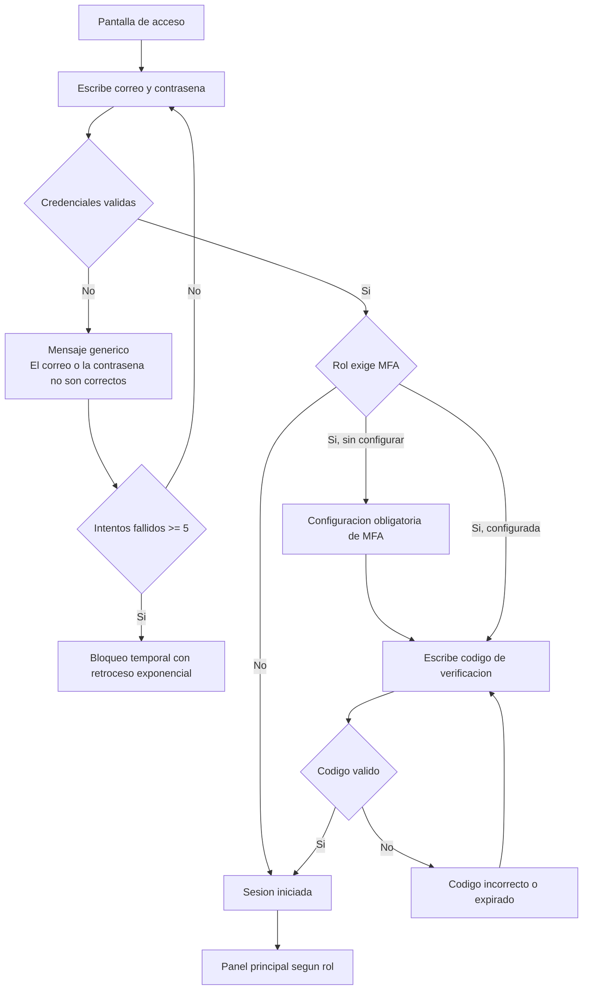
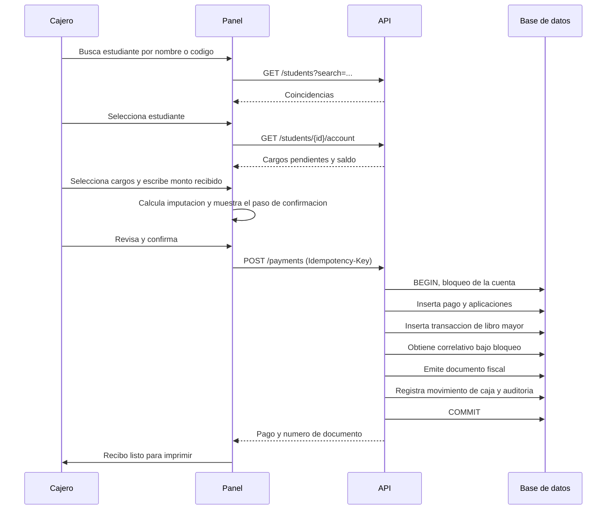
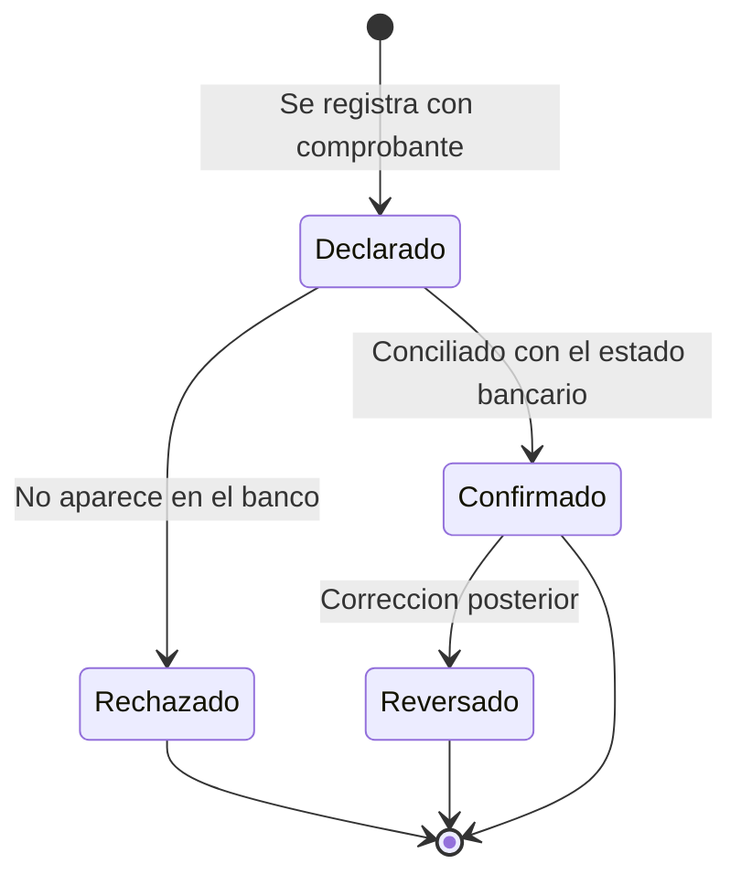
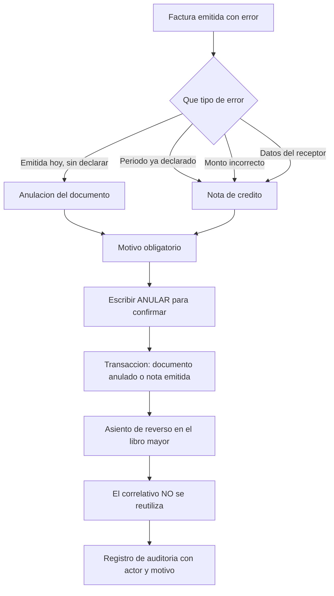
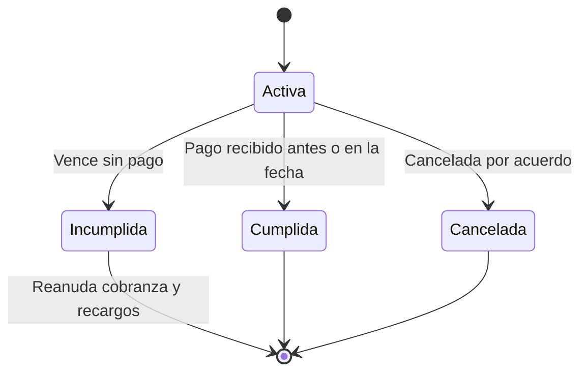
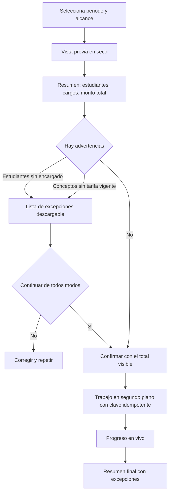

# Flujos clave

> Los trece recorridos críticos del sistema. Cada uno se implementa tal como está descrito y se
> automatiza como prueba de extremo a extremo. Ver `docs/06-estrategia-de-testing.md`.

---

## 1. Inicio de sesión del personal con MFA

**Actor:** cualquier usuario del panel administrativo.
**Precondición:** cuenta activa con MFA configurada si el rol tiene escritura financiera.

**Puntos de decisión.** El mensaje de credenciales incorrectas es idéntico exista o no la cuenta. El
bloqueo se aplica por cuenta y por dirección de origen. La configuración de MFA no se puede omitir
si el rol la exige.

**Manejo de error.** Cuenta bloqueada indica el tiempo restante. Un fallo del servicio de tiempo
impide la validación del código y se registra como incidente.

**Postcondición.** Sesión activa con token de acceso corto, token de refresco rotativo, y registro
en la bitácora de auditoría con dirección de origen y agente.

**Criterios de aceptación.** El recorrido completo se puede hacer solo con teclado. El campo de
código admite pegar. La respuesta ante credenciales inválidas tarda lo mismo exista o no la cuenta.

---

## 2. Apertura de sesión de caja

**Actor:** cajero.
**Precondición:** sesión iniciada, sin sesión de caja abierta a su nombre.

**Pasos.**

1. Entra a Caja. El sistema muestra que no tiene sesión abierta.
2. Pulsa Abrir caja.
3. Declara el fondo inicial en efectivo y selecciona el punto de emisión.
4. Confirma. El sistema registra la apertura con marca de tiempo del servidor.
5. La barra superior muestra un indicador permanente de caja abierta con el total acumulado.

**Manejo de error.** Si ya tiene una sesión abierta, el sistema la muestra en lugar de permitir otra.
Un cajero no puede tener dos sesiones simultáneas.

**Postcondición.** Sesión en estado abierto. A partir de aquí se permite registrar pagos en efectivo.

**Criterios de aceptación.** Sin sesión abierta, la acción de registrar pago en efectivo aparece
deshabilitada con explicación visible, no oculta.

---

## 3. Registro de un pago en efectivo en ventanilla

Es el flujo más importante del sistema. Se ejecuta decenas de veces al día con una fila de padres
esperando, así que la velocidad importa tanto como la corrección.

**Actor:** cajero. **Precondición:** sesión de caja abierta.

**El paso de confirmación es obligatorio y muestra, sin que el cajero tenga que deducir nada:**

- Estudiante y encargado que paga
- Cada cargo que se va a cubrir, con su monto aplicado
- El orden de imputación usado
- Recargos por mora incluidos, desglosados
- Total y cambio a devolver si el efectivo recibido es mayor
- Saldo a favor generado, si lo hay
- Qué documento fiscal se va a emitir

**Manejo de error.**

| Error | Comportamiento |
|---|---|
| Rango CAI agotado o vencido | El pago **sí** se registra. La factura queda pendiente de emisión con aviso visible |
| Error de red sin respuesta | Mensaje que prohíbe explícitamente reintentar y remite a verificar la lista de pagos |
| Monto mayor a la deuda | Advertencia con el saldo a favor que se generará. Requiere confirmación |
| Otro cajero cobró primero | El bloqueo serializa. El segundo ve el saldo ya actualizado |

**Postcondición.** Pago registrado, aplicado a cargos, asentado en el libro mayor, con documento
fiscal emitido, movimiento en la sesión de caja y registro de auditoría. Recibo impreso o
descargable.

**Criterios de aceptación.** El recorrido completo se puede hacer solo con teclado. La clave de
idempotencia se genera al abrir el formulario, no al enviarlo. Un doble clic no produce dos pagos.

---

## 4. Pago parcial o abono aplicado a varios cargos

**Actor:** cajero. **Precondición:** el estudiante tiene dos o más cargos pendientes.

**Pasos.**

1. El cajero abre el estado de cuenta y ve los cargos pendientes ordenados por vencimiento.
2. Escribe el monto recibido, menor al total adeudado.
3. El sistema propone la imputación según la política configurada, por defecto el cargo más antiguo
   primero.
4. El cajero puede **ajustar manualmente** la imputación si el encargado indica a qué concepto
   quiere abonar. El ajuste queda registrado con el usuario que lo hizo.
5. La pantalla muestra qué cargos quedan cubiertos por completo, cuál queda parcial y con qué saldo,
   y cuáles no se tocan.
6. Confirma.

**Postcondición.** Los cargos cubiertos quedan pagados. El cargo parcial queda en estado parcial con
su saldo. Cada aplicación es un asiento independiente y trazable.

**Criterios de aceptación.** Ninguna aplicación puede exceder el saldo del cargo, ni siquiera con
ajuste manual. El estado parcial se distingue visualmente del pendiente y del pagado.

---

## 5. Transferencia bancaria declarada por el encargado

**Actor:** personal de contabilidad. **Precondición:** el encargado notificó una transferencia.

**Pasos.**

1. Se registra el pago indicando método transferencia, banco, referencia, fecha y monto.
2. Se adjunta el comprobante enviado por el encargado.
3. El pago queda en estado **declarado**. Según la configuración de la institución, aplica al saldo
   de forma provisional o queda en espera.
4. El estado de cuenta muestra el pago con una marca clara de pendiente de confirmación.
5. Cuando llega el estado bancario, la conciliación lo empareja y pasa a **confirmado**.
6. Si no aparece en el banco tras el plazo configurado, se genera alerta y puede rechazarse con
   motivo.

**Criterios de aceptación.** Un pago declarado nunca se presenta al encargado como confirmado. La
diferencia entre ambos estados es visible en el portal.

---

## 6. Anulación de factura y nota de crédito

**Actor:** administrador o contabilidad con permiso de anulación. Este permiso **no** lo tiene el
cajero que registró el pago, por segregación de funciones.

**Manejo de error.** Una factura ya anulada no se puede anular de nuevo. Una nota de crédito no se
puede emitir sobre una factura anulada.

**Postcondición.** Documento en estado anulado o con nota de crédito asociada. El movimiento de
reverso aparece de forma permanente en el estado de cuenta, tachado y con su estado.

**Criterios de aceptación.** El árbol de decisión entre anulación y nota de crédito lo aplica el
sistema, no la memoria de la persona. El texto de consecuencia menciona explícitamente que el
correlativo no se reutiliza.

---

## 7. Cierre de caja con arqueo

**Actor:** cajero, con supervisión de administración si hay diferencia.

**Pasos.**

1. El cajero pulsa Cerrar caja al final del turno.
2. El sistema muestra el resumen: fondo inicial, movimientos por método de pago, y **el total
   esperado en efectivo**.
3. El cajero cuenta el efectivo físico y **escribe el conteo declarado**.
4. El sistema calcula la diferencia.

| Diferencia | Comportamiento |
|---|---|
| Cero | Cierre directo con confirmación |
| Dentro de la tolerancia configurada | Requiere justificación escrita |
| Fuera de la tolerancia | Requiere justificación y **autorización de un supervisor** |

5. Se confirma. La sesión pasa a cerrada y no admite más movimientos.
6. Se genera el reporte de cierre imprimible y firmable.

**Detalle de diseño importante:** el total esperado se muestra **antes** de que el cajero escriba su
conteo, para que el proceso sea transparente y no una trampa. Ocultarlo tienta a cuadrar el conteo
con el esperado en lugar de contar de verdad.

**Postcondición.** Sesión cerrada, diferencia registrada con responsable y justificación, reporte
generado. Si hubo diferencia fuera de tolerancia, se dispara alerta. Ver
`docs/runbooks/cierre-de-caja-con-diferencia.md`.

---

## 8. Registro de una promesa de pago

**Actor:** personal de cobranza. **Precondición:** el estudiante tiene cargos vencidos.

**Pasos.**

1. Desde el estado de cuenta o desde la lista de cobranza, se pulsa Registrar promesa.
2. Se seleccionan los cargos comprometidos, se indica la fecha comprometida y el monto, y se registra
   quién asumió el compromiso y por qué canal.
3. Se confirma.
4. Los cargos incluidos pasan a mostrar el estado **en promesa**.
5. Según la configuración, se suspende el ciclo de cobranza y el devengo de recargo hasta la fecha
   comprometida.

**Criterios de aceptación.** Una promesa vigente suprime el envío de avisos de cobro de esos cargos.
Al incumplirse, la cobranza se reanuda y queda el historial de promesas incumplidas visible.

---

## 9. Consulta del estado de cuenta por el personal

**Actor:** cualquier rol con permiso de lectura financiera.

**Pasos.**

1. Busca al estudiante desde la búsqueda global o desde el listado.
2. Abre su estado de cuenta.
3. La pantalla presenta, de arriba hacia abajo: resumen con saldo total, vencido y a favor; luego
   los cargos pendientes; luego el historial completo como línea de tiempo del libro mayor.
4. Puede filtrar por período y por tipo de movimiento.
5. Puede exportar a PDF o Excel, e imprimir.

**Criterios de aceptación.** El saldo mostrado se deriva del libro mayor, nunca de un campo
almacenado. Los movimientos reversados se muestran tachados, nunca ocultos. Cada movimiento enlaza
a su documento fiscal si existe.

---

## 10. Consulta del estado de cuenta por el encargado en móvil

**Actor:** encargado de pago. **Precondición:** cuenta verificada con estudiantes asociados.

**Pasos.**

1. Inicia sesión en el portal desde su teléfono.
2. Si tiene varios estudiantes, ve una lista de tarjetas con el nombre y el saldo de cada uno.
3. Selecciona un estudiante.
4. Ve, en este orden: cuánto debe hoy, qué vence pronto, y el historial de lo pagado.
5. Puede descargar comprobantes y facturas.

**Diseño específico para móvil.** Sin tablas: cada movimiento es una tarjeta apilada. El saldo
pendiente es el elemento más grande de la pantalla. El historial se carga por páginas al desplazar.
Si no debe nada, la pantalla lo dice de forma clara y positiva.

**Criterios de aceptación.** La política de seguridad a nivel de fila impide técnicamente ver datos
de un estudiante no asociado, aunque se manipule el identificador en la dirección. Existe una prueba
de integración que lo demuestra. La pantalla funciona a 320 píxeles de ancho.

---

## 11. Generación masiva de cargos del mes

**Actor:** administrador. **Precondición:** planes de cobro y tarifas vigentes configuradas.

**Puntos críticos.** La vista previa en seco es obligatoria: nadie genera cargos por más de un millón
de lempiras sin ver antes el número. El trabajo usa una clave de idempotencia derivada del período,
de modo que ejecutarlo dos veces no duplica cargos. Los estudiantes con problemas no bloquean al
resto: se listan como excepciones.

**Postcondición.** Cargos generados y asentados en el libro mayor. Reporte de ejecución con
excepciones descargable.

---

## 12. Ciclo de cobranza por atraso

**Actor:** el sistema, según reglas configuradas. Supervisado por cobranza.

**Pasos.**

1. Un trabajo diario identifica los cargos vencidos y calcula sus días de atraso.
2. Aplica las reglas de recargo por mora, respetando días de gracia, topes y exenciones por beca.
3. Determina qué aviso corresponde a cada encargado según los días de atraso.
4. **Excluye** a quienes tienen promesa de pago vigente y a quienes optaron por no recibir avisos.
5. Genera la cola de envíos.
6. Envía y registra cada intento con su estado de entrega.
7. Los rebotes y fallos quedan en una cola de revisión manual.

**Criterios de aceptación.** Ningún encargado recibe dos avisos del mismo cargo el mismo día. La
bitácora de envío permite demostrar que se notificó antes de aplicar un recargo. El cálculo de mora
es determinista y reproducible para una fecha dada, porque un padre va a reclamarlo.

---

## 13. Generación y exportación de un reporte financiero

**Actor:** contabilidad o dirección.

**Pasos.**

1. Selecciona el reporte y sus filtros: período, modalidad, grado, concepto, estado.
2. Ve una vista previa con los totales antes de exportar.
3. Elige el formato.

| Formato | Cuándo |
|---|---|
| CSV | Para procesar en otra herramienta. Sin formato, datos crudos |
| Excel | Para trabajo humano. Con formato, totales y una hoja de parámetros |
| PDF | Para archivar o entregar. Con encabezado institucional y firma |

4. Si el reporte es grande, se genera en segundo plano y se avisa al terminar con un enlace de
   descarga temporal.

**Criterios de aceptación.** Todo reporte exportado incluye los **parámetros con los que se generó**
y la fecha y hora de generación. Un reporte sin sus parámetros es un número sin contexto que nadie
puede reproducir después. Los filtros aplicados viven en la dirección web, de modo que la vista es
compartible.

---

## Documentos relacionados

- [04-patrones-de-interaccion.md](04-patrones-de-interaccion.md)
- [05-guia-de-contenido-y-voz.md](05-guia-de-contenido-y-voz.md)
- `openspec/specs/`
- `docs/06-estrategia-de-testing.md`
