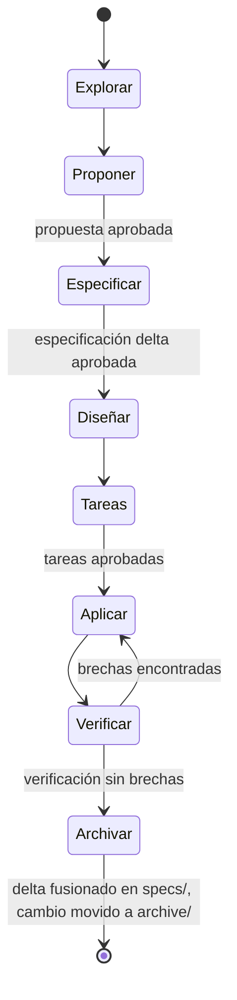

# openspec

Artefactos del ciclo de desarrollo dirigido por especificaciones (SDD) de CONFIA. El flujo
completo, los comandos y el formato de especificación están definidos en
`docs/13-metodologia-sdd.md`; este archivo explica solo la estructura de esta carpeta.

## Estructura

```
openspec/
├── project.md      # Contexto permanente del proyecto (stack, convenciones, capacidades)
├── specs/           # Especificaciones VIGENTES por capacidad: lo que el sistema hace hoy
│   └── <capacidad>/spec.md
├── changes/          # Cambios EN CURSO: lo que se pretende cambiar
│   └── <id-del-cambio>/
│       ├── proposal.md
│       ├── design.md
│       ├── tasks.md
│       └── specs/<capacidad>/spec.md   # delta: qué se agrega, modifica o elimina
└── archive/          # Cambios completados, con fecha de archivado
    └── <fecha>-<id-del-cambio>/
```

- **`specs/`** es la fotografía vigente del comportamiento del sistema, organizada por
  capacidad de negocio (`identity`, `ledger`, `payments`, `cashbox`, `invoicing`, y el resto
  listado en `project.md`).
- **`changes/`** contiene cada cambio activo con sus artefactos de planificación y su delta de
  especificación. Ver `openspec/changes/README.md` para el detalle de cada artefacto.
- **`archive/`** conserva el histórico de cambios ya cerrados, con la fecha de archivado como
  parte del nombre de carpeta. Sirve de trazabilidad hacia atrás: de la prueba automatizada al
  escenario, del escenario al requisito, del requisito a la propuesta.

## Ciclo de vida de un cambio



Cada flecha que cruza de una fase de planificación a la siguiente pasa por una puerta de
aprobación humana del propietario del producto. El agente no avanza solo.

## Regla dura

**Las especificaciones de `specs/` solo se actualizan al archivar un cambio, nunca durante un
cambio en curso.** Mientras un cambio está activo, lo único que se escribe es el delta dentro de
`openspec/changes/<id>/specs/`. Esto garantiza que `specs/` siempre refleja lo que el sistema
hace hoy en producción, no lo que un cambio en progreso pretende que haga. Fusionar el delta a
`specs/` antes de tiempo, o editar `specs/` directamente durante un cambio activo, rompe esa
garantía y se considera un defecto del proceso, no un atajo aceptable.
